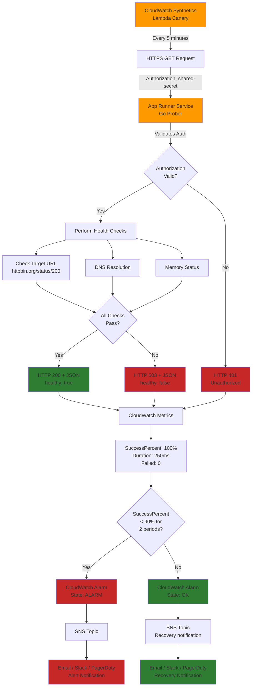

# Complete Example: AWS Prober

This is a complete, production-ready example showing how to use the `aws/prober` module to deploy a prober service to AWS App Runner with integrated CloudWatch Synthetics monitoring.

## What This Example Includes

1. **Sample Go Prober Application** (`app/`)
   - HTTP server with authorization validation
   - Configurable health checks against target URLs
   - JSON response with detailed check results
   - **Ready to deploy** - works out of the box!

2. **Automatic Resource Creation**
   - App Runner service with auto-scaling
   - CloudWatch Synthetics canary for uptime monitoring
   - IAM roles and policies (created automatically)
   - S3 bucket for canary artifacts
   - Optional SNS topic and CloudWatch alarms

3. **Minimal Configuration**
   - No need to define IAM roles separately
   - No need to create monitoring infrastructure manually
   - Just define your prober logic and deploy!

4. **Configurable Options**
   - Region selection (default: us-east-1)
   - Target URL to monitor
   - Email alerts (optional)
   - Resource sizing (CPU/memory)
   - Check frequency

## Prerequisites

1. **AWS Account** with appropriate permissions
2. **Terraform** >= 1.12
3. **AWS CLI** configured with credentials
4. **Go** >= 1.25 (for local testing)

## Quick Start

### 0. Test the Prober Locally (Optional)

```bash
# Run the prober locally (sets up environment automatically)
make test-local
```

This will start the prober on port 8080 with test configuration. In another terminal:
```bash
# Test with correct authorization
curl -H "Authorization: test-secret-123" http://localhost:8080/

# Should return JSON with status "healthy"
```

### 1. Navigate to Example Directory

```bash
cd terraform/public-modules/modules/aws/prober/example
```

### 2. Initialize Terraform

```bash
terraform init
```

### 3. Review the Configuration (Optional)

You can customize the deployment by passing variables:

```bash
# Deploy to a different region
terraform plan -var="region=us-west-2"

# Monitor a different URL
terraform plan -var="target_url=https://api.example.com"

# Enable email alerts
terraform plan -var="enable_alerts=true" -var="alert_email=oncall@example.com"
```

### 4. Deploy

```bash
terraform apply
```

This will create:
- App Runner service running your prober
- CloudWatch Synthetics canary checking the prober every 5 minutes
- IAM roles and policies
- S3 bucket for canary artifacts
- (Optional) SNS topic and CloudWatch alarm

### 5. Get the Service URL

```bash
terraform output prober_url
```

Example output:
```
prober_url = "https://xyz123.us-east-1.awsapprunner.com"
```

### 6. View the Authorization Secret (for testing)

```bash
terraform output -raw authorization_secret
```

**Important**: This secret is sensitive. It's used by the CloudWatch Synthetics canary to authenticate with your prober. Keep it secure!

### 7. Test the Deployed Prober

```bash
# Get the URL and secret
PROBER_URL=$(terraform output -raw prober_url)
AUTH_SECRET=$(terraform output -raw authorization_secret)

# Test with correct authorization (should return JSON)
curl -H "Authorization: $AUTH_SECRET" "$PROBER_URL/"

# Test with wrong authorization (should return 401)
curl -H "Authorization: wrong-secret" "$PROBER_URL/"
```

## Monitoring

### View Canary Status in AWS Console

1. Go to **CloudWatch** > **Synthetics** > **Canaries**
2. Find the canary named `example-prober-canary`
3. View metrics, screenshots, and execution history

### View Metrics

```bash
aws cloudwatch get-metric-statistics \
  --namespace CloudWatchSynthetics \
  --metric-name SuccessPercent \
  --dimensions Name=CanaryName,Value=example-prober-canary \
  --start-time $(date -u -d '1 hour ago' +%Y-%m-%dT%H:%M:%S) \
  --end-time $(date -u +%Y-%m-%dT%H:%M:%S) \
  --period 300 \
  --statistics Average \
  --region us-east-1
```

### View App Runner Logs

```bash
# Get the service ARN
SERVICE_ARN=$(terraform output -raw prober_name)

# View logs (requires AWS CLI v2)
aws apprunner describe-service \
  --service-arn $SERVICE_ARN \
  --region us-east-1
```

Or use CloudWatch Logs:
1. Go to **CloudWatch** > **Log groups**
2. Find `/aws/apprunner/example-prober/...`
3. View application logs

### Testing Alerts (Optional)

If you enabled alerts, you can test them by making the target URL unreachable:

```bash
# Change target URL to an invalid endpoint
terraform apply -var="target_url=https://invalid-url-that-does-not-exist.example.com"

# Wait 10-15 minutes for the alarm to trigger
# You should receive an email notification
```

## Customization Examples

### Monitor a Real API

```hcl
module "prod_api_prober" {
  source = "../"

  name    = "prod-api-health"
  team    = "sre"
  product = "platform"

  importpath  = "github.com/my-org/probers/api-health"
  working_dir = "${path.module}/../../probers/api-health"

  env = {
    TARGET_URL = "https://api.production.example.com/health"
    TIMEOUT    = "30s"
  }

  # Check every 1 minute
  canary_schedule = "rate(1 minute)"

  # Alert on failures
  enable_alert          = true
  notification_channels = [aws_sns_topic.oncall.arn]
}
```

### Use Secrets for Authentication

```hcl
# Create a secret
resource "aws_secretsmanager_secret" "api_token" {
  name = "prober-api-token"
}

resource "aws_secretsmanager_secret_version" "api_token" {
  secret_id     = aws_secretsmanager_secret.api_token.id
  secret_string = "your-api-token"
}

module "authenticated_prober" {
  source = "../"

  name    = "auth-api-health"
  team    = "platform"
  product = "monitoring"

  importpath  = "github.com/my-org/probers/auth-api"
  working_dir = "${path.module}/prober"

  env = {
    API_URL = "https://api.example.com/v1/health"
  }

  # Mount secret as environment variable
  secret_env = {
    API_TOKEN = aws_secretsmanager_secret.api_token.arn
  }
}
```

### Access Private Resources with VPC

```hcl
# Create VPC connector
resource "aws_apprunner_vpc_connector" "prober" {
  vpc_connector_name = "prober-vpc-connector"
  subnets            = var.private_subnet_ids
  security_groups    = [aws_security_group.prober.id]
}

module "internal_prober" {
  source = "../"

  name    = "internal-db-health"
  team    = "database"
  product = "monitoring"

  importpath  = "github.com/my-org/probers/db-health"
  working_dir = "${path.module}/prober"

  # Enable VPC access
  egress            = "VPC"
  vpc_connector_arn = aws_apprunner_vpc_connector.prober.arn

  env = {
    DATABASE_HOST = "postgres.internal.example.com"
    DATABASE_PORT = "5432"
  }

  secret_env = {
    DATABASE_PASSWORD = aws_secretsmanager_secret.db_password.arn
  }
}
```

### Larger Resources for Heavy Probers

```hcl
module "heavy_prober" {
  source = "../"

  name    = "load-test-prober"
  team    = "performance"
  product = "monitoring"

  importpath  = "github.com/my-org/probers/load-test"
  working_dir = "${path.module}/prober"

  # Increase resources
  cpu    = 2048 # 2 vCPU
  memory = 4096 # 4 GB

  # More aggressive scaling
  scaling = {
    min_instances                    = 2
    max_instances                    = 10
    max_instance_request_concurrency = 50
  }

  # Check more frequently
  canary_schedule = "rate(1 minute)"
}
```

## How It Works



## Cleanup

To destroy all resources:

```bash
terraform destroy
```


## Additional Resources

- [AWS App Runner Documentation](https://docs.aws.amazon.com/apprunner/)
- [CloudWatch Synthetics Documentation](https://docs.aws.amazon.com/AmazonCloudWatch/latest/monitoring/CloudWatch_Synthetics_Canaries.html)
- [Module Documentation](../README.md)
- [ko Build Tool](https://github.com/ko-build/ko)

<!-- BEGIN_TF_DOCS -->
## Requirements

| Name | Version |
|------|---------|
| <a name="requirement_aws"></a> [aws](#requirement\_aws) | 5.0 |
| <a name="requirement_cosign"></a> [cosign](#requirement\_cosign) | 0.0.20 |
| <a name="requirement_ko"></a> [ko](#requirement\_ko) | 0.0.19 |

## Providers

| Name | Version |
|------|---------|
| <a name="provider_aws"></a> [aws](#provider\_aws) | 5.0 |

## Modules

| Name | Source | Version |
|------|--------|---------|
| <a name="module_example_prober"></a> [example\_prober](#module\_example\_prober) | ../ | n/a |

## Resources

| Name | Type |
|------|------|
| [aws_sns_topic.prober_alerts](https://registry.terraform.io/providers/hashicorp/aws/5.0/docs/resources/sns_topic) | resource |
| [aws_sns_topic_subscription.prober_alerts_email](https://registry.terraform.io/providers/hashicorp/aws/5.0/docs/resources/sns_topic_subscription) | resource |
| [aws_caller_identity.current](https://registry.terraform.io/providers/hashicorp/aws/5.0/docs/data-sources/caller_identity) | data source |

## Inputs

| Name | Description | Type | Default | Required |
|------|-------------|------|---------|:--------:|
| <a name="input_alert_email"></a> [alert\_email](#input\_alert\_email) | Email address to receive alerts (optional) | `string` | `"cpanato@chainguard.dev"` | no |
| <a name="input_enable_alerts"></a> [enable\_alerts](#input\_enable\_alerts) | Enable CloudWatch alarms for the prober | `bool` | `true` | no |
| <a name="input_region"></a> [region](#input\_region) | AWS region to deploy the prober | `string` | `"us-east-1"` | no |
| <a name="input_target_url"></a> [target\_url](#input\_target\_url) | URL for the prober to check | `string` | `"https://httpbin.org/status/200"` | no |

## Outputs

| Name | Description |
|------|-------------|
| <a name="output_alarm_arn"></a> [alarm\_arn](#output\_alarm\_arn) | CloudWatch alarm ARN (if alerts are enabled) |
| <a name="output_authorization_secret"></a> [authorization\_secret](#output\_authorization\_secret) | The shared authorization secret (for testing only - keep secure!) |
| <a name="output_canary_name"></a> [canary\_name](#output\_canary\_name) | CloudWatch Synthetics canary name |
| <a name="output_prober_name"></a> [prober\_name](#output\_prober\_name) | App Runner service name |
| <a name="output_prober_url"></a> [prober\_url](#output\_prober\_url) | App Runner service URL for the prober |
| <a name="output_region"></a> [region](#output\_region) | AWS region where the prober is deployed |
| <a name="output_target_url"></a> [target\_url](#output\_target\_url) | Target URL being monitored |
<!-- END_TF_DOCS -->
