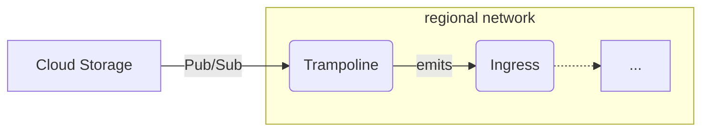

# `bucket-events`

This module provisions infrastructure to listen to events from a GCS bucket and
publish them to a broker.



This uses [Pub/Sub notifications for GCS](https://cloud.google.com/storage/docs/pubsub-notifications) and emits events of the following types:

| [GCS event type](https://cloud.google.com/storage/docs/pubsub-notifications#events) | CloudEvent type |
| ----- | ----- |
|	`OBJECT_FINALIZE` | `dev.chainguard.storage.object.finalize` |
| `OBJECT_METADATA_UPDATE` | `dev.chainguard.storage.object.metadata_update` |
| `OBJECT_DELETE` | `dev.chainguard.storage.object.delete` |
| `OBJECT_ARCHIVE` | `dev.chainguard.storage.object.archive` |


```hcl
// Create a network with several regional subnets
module "networking" {
  source = "chainguard-dev/common/infra//modules/networking"

  name       = "my-networking"
  project_id = var.project_id
  regions    = [...] # Note: the bucket's location must be among these regions.
}

// Create the Broker abstraction.
module "cloudevent-broker" {
  source = "chainguard-dev/common/infra//modules/cloudevent-broker"

  name       = "my-broker"
  project_id = var.project_id
  regions    = module.networking.regional-networks
}

// Get the bucket.
data "google_storage_bucket" "bucket" {
  name = "my-bucket"
}

// Forward events to the broker.
module "bucket-events" {
  source = "./modules/bucket-events"

  project_id = local.project
  name       = "bucket-events"
  bucket     = data.google_storage_bucket.bucket.name
  regions    = module.networking.regional-networks
  ingress    = module.cloudevent-broker.ingress
}
```

<!-- BEGIN_TF_DOCS -->
## Requirements

No requirements.

## Providers

| Name | Version |
|------|---------|
| <a name="provider_google"></a> [google](#provider\_google) | n/a |
| <a name="provider_google-beta"></a> [google-beta](#provider\_google-beta) | n/a |
| <a name="provider_random"></a> [random](#provider\_random) | n/a |

## Modules

| Name | Source | Version |
|------|--------|---------|
| <a name="module_audit-delivery-serviceaccount"></a> [audit-delivery-serviceaccount](#module\_audit-delivery-serviceaccount) | ../audit-serviceaccount | n/a |
| <a name="module_authorize-delivery"></a> [authorize-delivery](#module\_authorize-delivery) | ../authorize-private-service | n/a |
| <a name="module_http"></a> [http](#module\_http) | ../dashboard/sections/http | n/a |
| <a name="module_layout"></a> [layout](#module\_layout) | ../dashboard/sections/layout | n/a |
| <a name="module_logs"></a> [logs](#module\_logs) | ../dashboard/sections/logs | n/a |
| <a name="module_logurl"></a> [logurl](#module\_logurl) | ../logurl | n/a |
| <a name="module_markdown"></a> [markdown](#module\_markdown) | ../sections/markdown | n/a |
| <a name="module_resources"></a> [resources](#module\_resources) | ../dashboard/sections/resources | n/a |
| <a name="module_this"></a> [this](#module\_this) | ../regional-go-service | n/a |
| <a name="module_topic"></a> [topic](#module\_topic) | ../dashboard/sections/topic | n/a |
| <a name="module_trampoline-emits-events"></a> [trampoline-emits-events](#module\_trampoline-emits-events) | ../authorize-private-service | n/a |
| <a name="module_width"></a> [width](#module\_width) | ../dashboard/sections/width | n/a |

## Resources

| Name | Type |
|------|------|
| [google-beta_google_project_service_identity.pubsub](https://registry.terraform.io/providers/hashicorp/google-beta/latest/docs/resources/google_project_service_identity) | resource |
| [google_monitoring_dashboard.dashboard](https://registry.terraform.io/providers/hashicorp/google/latest/docs/resources/monitoring_dashboard) | resource |
| [google_pubsub_subscription.this](https://registry.terraform.io/providers/hashicorp/google/latest/docs/resources/pubsub_subscription) | resource |
| [google_pubsub_subscription_iam_binding.allow-pubsub-to-ack](https://registry.terraform.io/providers/hashicorp/google/latest/docs/resources/pubsub_subscription_iam_binding) | resource |
| [google_pubsub_topic.dead-letter](https://registry.terraform.io/providers/hashicorp/google/latest/docs/resources/pubsub_topic) | resource |
| [google_pubsub_topic.internal](https://registry.terraform.io/providers/hashicorp/google/latest/docs/resources/pubsub_topic) | resource |
| [google_pubsub_topic_iam_binding.allow-pubsub-to-send-to-dead-letter](https://registry.terraform.io/providers/hashicorp/google/latest/docs/resources/pubsub_topic_iam_binding) | resource |
| [google_pubsub_topic_iam_binding.binding](https://registry.terraform.io/providers/hashicorp/google/latest/docs/resources/pubsub_topic_iam_binding) | resource |
| [google_service_account.delivery](https://registry.terraform.io/providers/hashicorp/google/latest/docs/resources/service_account) | resource |
| [google_service_account.service](https://registry.terraform.io/providers/hashicorp/google/latest/docs/resources/service_account) | resource |
| [google_service_account_iam_binding.allow-pubsub-to-mint-tokens](https://registry.terraform.io/providers/hashicorp/google/latest/docs/resources/service_account_iam_binding) | resource |
| [google_storage_notification.notification](https://registry.terraform.io/providers/hashicorp/google/latest/docs/resources/storage_notification) | resource |
| [random_string.delivery-suffix](https://registry.terraform.io/providers/hashicorp/random/latest/docs/resources/string) | resource |
| [random_string.service-suffix](https://registry.terraform.io/providers/hashicorp/random/latest/docs/resources/string) | resource |
| [google_storage_bucket.bucket](https://registry.terraform.io/providers/hashicorp/google/latest/docs/data-sources/storage_bucket) | data source |
| [google_storage_project_service_account.gcs_account](https://registry.terraform.io/providers/hashicorp/google/latest/docs/data-sources/storage_project_service_account) | data source |

## Inputs

| Name | Description | Type | Default | Required |
|------|-------------|------|---------|:--------:|
| <a name="input_bucket"></a> [bucket](#input\_bucket) | The name of the bucket to watch for events. The region where the bucket is located will be the region where the Pub/Sub topic and trampoline service will be created. The bucket must be in a region that is in the set of regions passed to the regions variable. | `string` | n/a | yes |
| <a name="input_gcs_event_types"></a> [gcs\_event\_types](#input\_gcs\_event\_types) | The types of GCS events to watch for (https://cloud.google.com/storage/docs/pubsub-notifications#payload). | `list(string)` | <pre>[<br>  "OBJECT_FINALIZE",<br>  "OBJECT_METADATA_UPDATE",<br>  "OBJECT_DELETE",<br>  "OBJECT_ARCHIVE"<br>]</pre> | no |
| <a name="input_ingress"></a> [ingress](#input\_ingress) | An object holding the name of the ingress service, which can be used to authorize callers to publish cloud events. | <pre>object({<br>    name = string<br>  })</pre> | n/a | yes |
| <a name="input_max_delivery_attempts"></a> [max\_delivery\_attempts](#input\_max\_delivery\_attempts) | The maximum number of delivery attempts for any event. | `number` | `5` | no |
| <a name="input_name"></a> [name](#input\_name) | n/a | `string` | n/a | yes |
| <a name="input_notification_channels"></a> [notification\_channels](#input\_notification\_channels) | List of notification channels to alert. | `list(string)` | n/a | yes |
| <a name="input_project_id"></a> [project\_id](#input\_project\_id) | n/a | `string` | n/a | yes |
| <a name="input_regions"></a> [regions](#input\_regions) | A map from region names to a network and subnetwork. The bucket must be in one of these regions. | <pre>map(object({<br>    network = string<br>    subnet  = string<br>  }))</pre> | n/a | yes |

## Outputs

No outputs.
<!-- END_TF_DOCS -->
