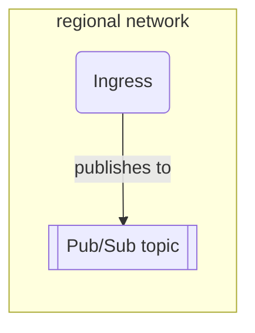

# `cloudevent-broker`



This module provisions a regionalizied Broker abstraction akin to the Knative
"Broker" concept. The dual "Trigger" concept is captured by the sibling
`cloudevent-trigger` module. The intended usage of this module for publishing
events is something like this:

```hcl
// Create a network with several regional subnets
module "networking" {
  source = "chainguard-dev/common/infra//modules/networking"

  name       = "my-networking"
  project_id = var.project_id
  regions    = [...]
}

// Create the Broker abstraction.
module "cloudevent-broker" {
  source = "chainguard-dev/common/infra//modules/cloudevent-broker"

  name       = "my-broker"
  project_id = var.project_id
  regions    = module.networking.regional-networks

  // Add your notification channels for alerting (required)
  notification_channels = []
}

// Authorize the "foo" service account to publish events.
module "foo-emits-events" {
  for_each = module.networking.regional-networks

  source = "chainguard-dev/common/infra//modules/authorize-private-service"

  project_id = var.project_id
  region     = each.key
  name       = module.cloudevent-broker.ingress.name

  service-account = google_service_account.foo.email
}

// Run a cloud run service as the "foo" service account, and pass in the address
// of the regional ingress endpoint.
module "foo-service" {
  source = "chainguard-dev/common/infra//modules/regional-go-service"

  project_id = var.project_id
  name       = "foo"
  regions    = module.networking.regional-networks

  service_account = google_service_account.foo.email
  containers = {
    "foo" = {
      source = {
        working_dir = path.module
        importpath  = "./cmd/foo"
      }
      ports = [{ container_port = 8080 }]
      regional-env = [{
        name  = "EVENT_INGRESS_URI"
        value = { for k, v in module.foo-emits-events : k => v.uri }
      }]
    }
  }
}
```

<!-- BEGIN_TF_DOCS -->
## Requirements

No requirements.

## Providers

| Name | Version |
|------|---------|
| <a name="provider_google"></a> [google](#provider\_google) | n/a |

## Modules

| Name | Source | Version |
|------|--------|---------|
| <a name="module_dashboard"></a> [dashboard](#module\_dashboard) | ../dashboard | n/a |
| <a name="module_http"></a> [http](#module\_http) | ../dashboard/sections/http | n/a |
| <a name="module_layout"></a> [layout](#module\_layout) | ../dashboard/sections/layout | n/a |
| <a name="module_logs"></a> [logs](#module\_logs) | ../dashboard/sections/logs | n/a |
| <a name="module_resources"></a> [resources](#module\_resources) | ../dashboard/sections/resources | n/a |
| <a name="module_this"></a> [this](#module\_this) | ../regional-go-service | n/a |
| <a name="module_topic"></a> [topic](#module\_topic) | ../dashboard/sections/topic | n/a |
| <a name="module_width"></a> [width](#module\_width) | ../dashboard/sections/width | n/a |

## Resources

| Name | Type |
|------|------|
| [google_pubsub_topic.this](https://registry.terraform.io/providers/hashicorp/google/latest/docs/resources/pubsub_topic) | resource |
| [google_pubsub_topic_iam_binding.ingress-publishes-events](https://registry.terraform.io/providers/hashicorp/google/latest/docs/resources/pubsub_topic_iam_binding) | resource |
| [google_service_account.this](https://registry.terraform.io/providers/hashicorp/google/latest/docs/resources/service_account) | resource |

## Inputs

| Name | Description | Type | Default | Required |
|------|-------------|------|---------|:--------:|
| <a name="input_cpu_idle"></a> [cpu\_idle](#input\_cpu\_idle) | Set to false for a region in order to use instance-based billing. Defaults to true. | `map(bool)` | `{}` | no |
| <a name="input_deletion_protection"></a> [deletion\_protection](#input\_deletion\_protection) | Whether to enable delete protection for the service. | `bool` | `true` | no |
| <a name="input_enable_profiler"></a> [enable\_profiler](#input\_enable\_profiler) | Enable cloud profiler. | `bool` | `false` | no |
| <a name="input_labels"></a> [labels](#input\_labels) | Labels to apply to the broker resources. | `map(string)` | `{}` | no |
| <a name="input_limits"></a> [limits](#input\_limits) | Resource limits for the regional go service. | <pre>object({<br/>    cpu    = string<br/>    memory = string<br/>  })</pre> | `null` | no |
| <a name="input_name"></a> [name](#input\_name) | n/a | `string` | n/a | yes |
| <a name="input_notification_channels"></a> [notification\_channels](#input\_notification\_channels) | List of notification channels to alert. | `list(string)` | n/a | yes |
| <a name="input_product"></a> [product](#input\_product) | Product label to apply to the service. | `string` | `"unknown"` | no |
| <a name="input_project_id"></a> [project\_id](#input\_project\_id) | n/a | `string` | n/a | yes |
| <a name="input_regions"></a> [regions](#input\_regions) | A map from region names to a network and subnetwork.  A pub/sub topic and ingress service (publishing to the respective topic) will be created in each region, with the ingress service configured to egress all traffic via the specified subnetwork. | <pre>map(object({<br/>    network = string<br/>    subnet  = string<br/>  }))</pre> | n/a | yes |
| <a name="input_scaling"></a> [scaling](#input\_scaling) | The scaling configuration for the service. | <pre>object({<br/>    min_instances                    = optional(number, 0)<br/>    max_instances                    = optional(number, 100)<br/>    max_instance_request_concurrency = optional(number)<br/>  })</pre> | `{}` | no |
| <a name="input_squad"></a> [squad](#input\_squad) | DEPRECATED: Use 'team' instead. Squad label to apply to resources. | `string` | `""` | no |
| <a name="input_team"></a> [team](#input\_team) | Team label to apply to resources (replaces deprecated 'squad'). | `string` | `""` | no |

## Outputs

| Name | Description |
|------|-------------|
| <a name="output_broker"></a> [broker](#output\_broker) | A map from each of the input region names to the name of the Broker topic in each region.  These broker names are intended for use with the cloudevent-trigger module's broker input. |
| <a name="output_ingress"></a> [ingress](#output\_ingress) | An object holding the name of the ingress service, which can be used to authorize callers to publish cloud events. |
<!-- END_TF_DOCS -->
