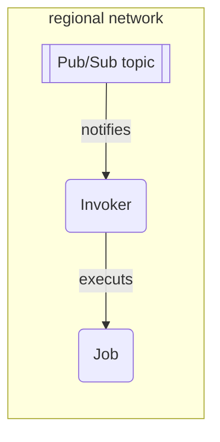

# `cloudevent-job`



This module abstracts regionalizied event-triggered Cloud Run Jobs.
It's intended to be used with the "Broker" abstraction is described by the sibling [`cloudevent-broker`](./../cloudevent-broker/) module.

This can be helpful if you need to trigger a long-running task written in Go.

When the Job is invoked, it will be invoked with one argument, `--event`, which will contain the JSON-encoded raw event payload. Any other information should be configured as an environment variable in the container spec.

When the Job times out, it gets the normal shutdown signal, and the code inside it should handle this gracefully if necessary.

### Limitations and Alternatives

- There is no concurrency control
  - There's currently no way to limit the number of Jobs that can be run concurrently.
  - There's currently no way to stop a running Job when a new similar Job is triggered.
  - There are controls for [parallel _tasks_](https://cloud.google.com/run/docs/configuring/parallelism) within a Job, but no controls for parallel Jobs.
- [Retries](https://cloud.google.com/run/docs/configuring/max-retries) are managed by Cloud Run, and the only control available is `max_retries`
  - There's no control for exponential backoff, or other retry strategies.
- There's a [region-wide limit](https://cloud.google.com/run/quotas) of 1000 Job definitions, and 1000 running Job executions.
  - See [Quotas and Limits](https://cloud.google.com/run/quotas) for more information.

If you don't need a long-running Job -- if work can be expected to complete within 10 minutes -- you should use [`cloudevent-trigger`](./../cloudevent-trigger/) instead, with a `regional-go-service` or `regional-service`.

If you expect lots of similar executions and want to avoid doing the same work multiple times concurrently, you should use [`workqueue`](./../workqueue/) instead. Note that `workqueue` does not support long-running Jobs over 10 minutes.

### Regionalization

By default, trigger services will be created in every region, and invoke Jobs in their local region. If you want to only run jobs in one region, you can set the `job.region` to a single region within the set of regions in your regional networks. This will instruct the regional trigger services to only execute the Job in that single region.

The intended usage of this module for consuming events is something like this:

```hcl
// Create a network with several regional subnets
module "networking" {
  source = "chainguard-dev/common/infra//modules/networking"

  name       = "my-networking"
  project_id = var.project_id
  regions    = [...]
}

// Create the Broker abstraction.
module "cloudevent-broker" {
  source = "chainguard-dev/common/infra//modules/cloudevent-broker"

  name       = "my-broker"
  project_id = var.project_id
  regions    = module.networking.regional-networks
}

// Set up regionalized services to deliver filtered events from our regionalized
// brokers to our regionalized Jobs.
module "cloudevent-job" {
  for_each = module.networking.regional-networks

  source = "chainguard-dev/common/infra//modules/cloudevent-job"

  name       = "bar"
  project_id = var.project_id
  broker     = module.cloudevent-broker.broker

  // Only trigger on bar-type events.
  filter     = { "type" : "dev.chainguard.bar" }

  job = {
    name = "my-job"
    source = {
      importpath = "./cmd/bar"
    }
  }
}
```

<!-- BEGIN_TF_DOCS -->
## Requirements

No requirements.

## Providers

| Name | Version |
|------|---------|
| <a name="provider_google"></a> [google](#provider\_google) | n/a |
| <a name="provider_google-beta"></a> [google-beta](#provider\_google-beta) | n/a |
| <a name="provider_ko"></a> [ko](#provider\_ko) | n/a |

## Modules

| Name | Source | Version |
|------|--------|---------|
| <a name="module_invoker"></a> [invoker](#module\_invoker) | ../regional-go-service | n/a |
| <a name="module_trigger"></a> [trigger](#module\_trigger) | ../cloudevent-trigger | n/a |

## Resources

| Name | Type |
|------|------|
| [google-beta_google_cloud_run_v2_job.job](https://registry.terraform.io/providers/hashicorp/google-beta/latest/docs/resources/google_cloud_run_v2_job) | resource |
| [google_cloud_run_v2_job_iam_binding.invoker](https://registry.terraform.io/providers/hashicorp/google/latest/docs/resources/cloud_run_v2_job_iam_binding) | resource |
| [google_service_account.invoker](https://registry.terraform.io/providers/hashicorp/google/latest/docs/resources/service_account) | resource |
| [ko_build.image](https://registry.terraform.io/providers/ko-build/ko/latest/docs/resources/build) | resource |

## Inputs

| Name | Description | Type | Default | Required |
|------|-------------|------|---------|:--------:|
| <a name="input_ack_deadline_seconds"></a> [ack\_deadline\_seconds](#input\_ack\_deadline\_seconds) | The deadline for acking a message. | `number` | `300` | no |
| <a name="input_base_image"></a> [base\_image](#input\_base\_image) | The base image that will be used to build the Job's container image. | `string` | `"cgr.dev/chainguard/static:latest-glibc"` | no |
| <a name="input_broker"></a> [broker](#input\_broker) | A map from each of the input region names to the name of the Broker topic in that region. | `map(string)` | n/a | yes |
| <a name="input_cpu"></a> [cpu](#input\_cpu) | The CPU limit for the job. | `string` | `"1000m"` | no |
| <a name="input_deletion_protection"></a> [deletion\_protection](#input\_deletion\_protection) | Whether to enable delete protection for the service. | `bool` | `true` | no |
| <a name="input_enable_otel_sidecar"></a> [enable\_otel\_sidecar](#input\_enable\_otel\_sidecar) | Enable otel sidecar for metrics | `bool` | `false` | no |
| <a name="input_execution_environment"></a> [execution\_environment](#input\_execution\_environment) | The execution environment to use for the job. | `string` | `""` | no |
| <a name="input_filter"></a> [filter](#input\_filter) | A Knative Trigger-style filter over the cloud event attributes.<br/><br/>This is normally used to filter relevant event types, for example:<br/><br/>  { "type" : "dev.chainguard.foo" }<br/><br/>In this case, only events with a type attribute of "dev.chainguard.foo" will be delivered. | `map(string)` | `{}` | no |
| <a name="input_filter_has_attributes"></a> [filter\_has\_attributes](#input\_filter\_has\_attributes) | A Knative Trigger-style filter over the cloud event attribute prefixes.<br/><br/>This can be used to filter on the presence of an event attribute, for example:<br/><br/>  ["location"]<br/><br/>In this case, any event with a type attribute of "location" will be delivered. | `list(string)` | `[]` | no |
| <a name="input_filter_not_has_attributes"></a> [filter\_not\_has\_attributes](#input\_filter\_not\_has\_attributes) | A Knative Trigger-style filter over the cloud event attribute prefixes.<br/><br/>This can be used to filter on the absence of an event attribute, for example:<br/><br/>  ["location"]<br/><br/>In this case, any event with a type attribute of "location" will NOT be delivered. | `list(string)` | `[]` | no |
| <a name="input_filter_prefix"></a> [filter\_prefix](#input\_filter\_prefix) | A Knative Trigger-style filter over the cloud event attribute prefixes.<br/><br/>This can be used to filter relevant event types, for example:<br/><br/>  { "type" : "dev.chainguard." }<br/><br/>In this case, any event with a type attribute that starts with "dev.chainguard." will be delivered. | `map(string)` | `{}` | no |
| <a name="input_job"></a> [job](#input\_job) | The Cloud Run Job to invoke when an event is received. | <pre>object({<br/>    name            = string<br/>    service_account = string<br/>    // If unset, the job will be run in every region in var.regions.<br/>    // If set, it must be a key in var.regions.<br/>    region = optional(string, "")<br/>    source = object({<br/>      importpath  = string<br/>      working_dir = string<br/>      base_image  = optional(string, "")<br/>    })<br/>  })</pre> | n/a | yes |
| <a name="input_labels"></a> [labels](#input\_labels) | Labels to apply to the job. | `map(string)` | `{}` | no |
| <a name="input_max_delivery_attempts"></a> [max\_delivery\_attempts](#input\_max\_delivery\_attempts) | The maximum number of delivery attempts for any event. | `number` | `20` | no |
| <a name="input_max_retries"></a> [max\_retries](#input\_max\_retries) | The maximum number of times to retry the job. | `number` | `3` | no |
| <a name="input_maximum_backoff"></a> [maximum\_backoff](#input\_maximum\_backoff) | The maximum delay between consecutive deliveries of a given message. | `number` | `600` | no |
| <a name="input_memory"></a> [memory](#input\_memory) | The memory limit for the job. | `string` | `"512Mi"` | no |
| <a name="input_minimum_backoff"></a> [minimum\_backoff](#input\_minimum\_backoff) | The minimum delay between consecutive deliveries of a given message. | `number` | `10` | no |
| <a name="input_name"></a> [name](#input\_name) | n/a | `string` | n/a | yes |
| <a name="input_notification_channels"></a> [notification\_channels](#input\_notification\_channels) | List of notification channels to alert. | `list(string)` | n/a | yes |
| <a name="input_otel_collector_image"></a> [otel\_collector\_image](#input\_otel\_collector\_image) | The otel collector image to use as a base. Must be on gcr.io or dockerhub. | `string` | `"chainguard/opentelemetry-collector-contrib:latest"` | no |
| <a name="input_parallelism"></a> [parallelism](#input\_parallelism) | The number of parallel jobs to run. Must be <= task\_count | `number` | `1` | no |
| <a name="input_project_id"></a> [project\_id](#input\_project\_id) | n/a | `string` | n/a | yes |
| <a name="input_raw_filter"></a> [raw\_filter](#input\_raw\_filter) | Raw PubSub filter to apply, ignores other variables. https://cloud.google.com/pubsub/docs/subscription-message-filter#filtering_syntax | `string` | `""` | no |
| <a name="input_regions"></a> [regions](#input\_regions) | A map from region names to a network and subnetwork.  A pub/sub topic and ingress service (publishing to the respective topic) will be created in each region, with the ingress service configured to egress all traffic via the specified subnetwork. | <pre>map(object({<br/>    network = string<br/>    subnet  = string<br/>  }))</pre> | n/a | yes |
| <a name="input_require_squad"></a> [require\_squad](#input\_require\_squad) | Whether to require squad variable to be specified | `bool` | `true` | no |
| <a name="input_squad"></a> [squad](#input\_squad) | squad label to apply to the service. | `string` | `""` | no |
| <a name="input_task_count"></a> [task\_count](#input\_task\_count) | The number of tasks to run. | `number` | `1` | no |
| <a name="input_timeout"></a> [timeout](#input\_timeout) | The maximum amount of time in seconds to allow the job to run. | `string` | `"600s"` | no |

## Outputs

No outputs.
<!-- END_TF_DOCS -->
