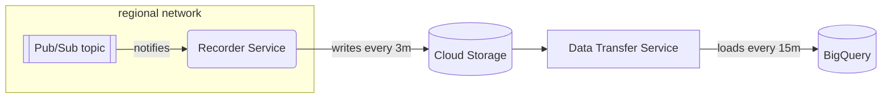

# `cloudevent-recorder`

This module provisions a regionalized event subscriber that consumes events of
particular types from each of the regional brokers, writes them to Google BigQuery.



The recorder service writes to a regional GCS bucket where a periodic BigQuery Data-Transfer Service Job will pull events from into a BigQuery table schematized for that event type.

The intended usage of this module for publishing events is something like this:

```hcl
// Create a network with several regional subnets
module "networking" {
  source = "chainguard-dev/common/infra//modules/networking"

  name       = "my-networking"
  project_id = var.project_id
  regions    = [...]
}

// Create the Broker abstraction.
module "cloudevent-broker" {
  source = "chainguard-dev/common/infra//modules/cloudevent-broker"

  name       = "my-broker"
  project_id = var.project_id
  regions    = module.networking.regional-networks
}

// Record cloudevents of type com.example.foo and com.example.bar
module "foo-emits-events" {
  source = "chainguard-dev/common/infra//modules/cloudevent-recorder"

  name       = "my-recorder"
  project_id = var.project_id
  regions    = module.networking.regional-networks
  broker     = module.cloudevent-broker.broker

  retention-period = 30 // keep around 30 days worth of event data

  provisioner = "user:sally@chainguard.dev"

  types = {
    "com.example.foo": {
      schema = file("${path.module}/foo.schema.json")
    }
    "com.example.bar": {
      schema = file("${path.module}/bar.schema.json")
    }
  }
}
```

The default behavior of this module is to deploy a cloud event trigger that consumes events from a broker and uses log
rotate to write them to a GCS bucket. The GCS bucket is then used as a source for a BigQuery Data Transfer Service job.

To override this behavior, you can choose a different `method`.

i.e. to use GCP native integration for pubsub to GCS:

```hcl
module "foo-emits-events" {
  source = "chainguard-dev/common/infra//modules/cloudevent-recorder"
  method = "gcs"

  ...
}
```
<!-- BEGIN_TF_DOCS -->
## Requirements

No requirements.

## Providers

| Name | Version |
|------|---------|
| <a name="provider_google"></a> [google](#provider\_google) | n/a |
| <a name="provider_google-beta"></a> [google-beta](#provider\_google-beta) | n/a |
| <a name="provider_random"></a> [random](#provider\_random) | n/a |

## Modules

| Name | Source | Version |
|------|--------|---------|
| <a name="module_recorder-dashboard"></a> [recorder-dashboard](#module\_recorder-dashboard) | ../dashboard/cloudevent-receiver | n/a |
| <a name="module_this"></a> [this](#module\_this) | ../regional-go-service | n/a |
| <a name="module_triggers"></a> [triggers](#module\_triggers) | ../cloudevent-trigger | n/a |

## Resources

| Name | Type |
|------|------|
| [google-beta_google_project_service_identity.pubsub](https://registry.terraform.io/providers/hashicorp/google-beta/latest/docs/resources/google_project_service_identity) | resource |
| [google_bigquery_data_transfer_config.import-job](https://registry.terraform.io/providers/hashicorp/google/latest/docs/resources/bigquery_data_transfer_config) | resource |
| [google_bigquery_dataset.this](https://registry.terraform.io/providers/hashicorp/google/latest/docs/resources/bigquery_dataset) | resource |
| [google_bigquery_table.types](https://registry.terraform.io/providers/hashicorp/google/latest/docs/resources/bigquery_table) | resource |
| [google_bigquery_table_iam_binding.import-writes-to-tables](https://registry.terraform.io/providers/hashicorp/google/latest/docs/resources/bigquery_table_iam_binding) | resource |
| [google_monitoring_alert_policy.bq_dts](https://registry.terraform.io/providers/hashicorp/google/latest/docs/resources/monitoring_alert_policy) | resource |
| [google_pubsub_subscription.dead-letter-pull-sub](https://registry.terraform.io/providers/hashicorp/google/latest/docs/resources/pubsub_subscription) | resource |
| [google_pubsub_subscription.this](https://registry.terraform.io/providers/hashicorp/google/latest/docs/resources/pubsub_subscription) | resource |
| [google_pubsub_subscription_iam_binding.allow-pubsub-to-ack](https://registry.terraform.io/providers/hashicorp/google/latest/docs/resources/pubsub_subscription_iam_binding) | resource |
| [google_pubsub_topic.dead-letter](https://registry.terraform.io/providers/hashicorp/google/latest/docs/resources/pubsub_topic) | resource |
| [google_pubsub_topic_iam_binding.allow-pubsub-to-send-to-dead-letter](https://registry.terraform.io/providers/hashicorp/google/latest/docs/resources/pubsub_topic_iam_binding) | resource |
| [google_service_account.import-identity](https://registry.terraform.io/providers/hashicorp/google/latest/docs/resources/service_account) | resource |
| [google_service_account.recorder](https://registry.terraform.io/providers/hashicorp/google/latest/docs/resources/service_account) | resource |
| [google_service_account_iam_binding.bq-dts-assumes-import-identity](https://registry.terraform.io/providers/hashicorp/google/latest/docs/resources/service_account_iam_binding) | resource |
| [google_service_account_iam_binding.provisioner-acts-as-import-identity](https://registry.terraform.io/providers/hashicorp/google/latest/docs/resources/service_account_iam_binding) | resource |
| [google_storage_bucket.recorder](https://registry.terraform.io/providers/hashicorp/google/latest/docs/resources/storage_bucket) | resource |
| [google_storage_bucket_iam_binding.broker-writes-to-gcs-buckets](https://registry.terraform.io/providers/hashicorp/google/latest/docs/resources/storage_bucket_iam_binding) | resource |
| [google_storage_bucket_iam_binding.import-reads-from-gcs-buckets](https://registry.terraform.io/providers/hashicorp/google/latest/docs/resources/storage_bucket_iam_binding) | resource |
| [google_storage_bucket_iam_binding.recorder-writes-to-gcs-buckets](https://registry.terraform.io/providers/hashicorp/google/latest/docs/resources/storage_bucket_iam_binding) | resource |
| [random_id.suffix](https://registry.terraform.io/providers/hashicorp/random/latest/docs/resources/id) | resource |
| [random_id.trigger-suffix](https://registry.terraform.io/providers/hashicorp/random/latest/docs/resources/id) | resource |
| [random_string.suffix](https://registry.terraform.io/providers/hashicorp/random/latest/docs/resources/string) | resource |
| [google_client_openid_userinfo.me](https://registry.terraform.io/providers/hashicorp/google/latest/docs/data-sources/client_openid_userinfo) | data source |
| [google_project.project](https://registry.terraform.io/providers/hashicorp/google/latest/docs/data-sources/project) | data source |

## Inputs

| Name | Description | Type | Default | Required |
|------|-------------|------|---------|:--------:|
| <a name="input_ack_deadline_seconds"></a> [ack\_deadline\_seconds](#input\_ack\_deadline\_seconds) | The number of seconds to acknowledge a message before it is redelivered. | `number` | `300` | no |
| <a name="input_broker"></a> [broker](#input\_broker) | A map from each of the input region names to the name of the Broker topic in that region. | `map(string)` | n/a | yes |
| <a name="input_cloud_storage_config_max_bytes"></a> [cloud\_storage\_config\_max\_bytes](#input\_cloud\_storage\_config\_max\_bytes) | The maximum bytes that can be written to a Cloud Storage file before a new file is created. Min 1 KB, max 10 GiB. | `number` | `1000000000` | no |
| <a name="input_cloud_storage_config_max_duration"></a> [cloud\_storage\_config\_max\_duration](#input\_cloud\_storage\_config\_max\_duration) | The maximum duration that can elapse before a new Cloud Storage file is created. Min 1 minute, max 10 minutes, default 5 minutes. | `number` | `300` | no |
| <a name="input_deletion_protection"></a> [deletion\_protection](#input\_deletion\_protection) | Whether to enable deletion protection on data resources. | `bool` | `true` | no |
| <a name="input_enable_profiler"></a> [enable\_profiler](#input\_enable\_profiler) | Enable cloud profiler. | `bool` | `false` | no |
| <a name="input_flush_interval"></a> [flush\_interval](#input\_flush\_interval) | Flush interval for logrotate, as a duration string. | `string` | `""` | no |
| <a name="input_ignore_unknown_values"></a> [ignore\_unknown\_values](#input\_ignore\_unknown\_values) | Whether to ignore unknown values in the data, when transferring data to BigQuery. | `bool` | `false` | no |
| <a name="input_labels"></a> [labels](#input\_labels) | Labels to apply to the BigQuery and storage resources. | `map(string)` | `{}` | no |
| <a name="input_limits"></a> [limits](#input\_limits) | Resource limits for the regional go service. | <pre>object({<br/>    cpu    = string<br/>    memory = string<br/>  })</pre> | `null` | no |
| <a name="input_local_disk_mount"></a> [local\_disk\_mount](#input\_local\_disk\_mount) | Whether to use alpha local disk mount option. | `bool` | `false` | no |
| <a name="input_location"></a> [location](#input\_location) | The location to create the BigQuery dataset in, and in which to run the data transfer jobs from GCS. | `string` | `"US"` | no |
| <a name="input_max_delivery_attempts"></a> [max\_delivery\_attempts](#input\_max\_delivery\_attempts) | The maximum number of delivery attempts for any event. | `number` | `5` | no |
| <a name="input_maximum_backoff"></a> [maximum\_backoff](#input\_maximum\_backoff) | The maximum delay between consecutive deliveries of a given message. | `number` | `600` | no |
| <a name="input_method"></a> [method](#input\_method) | The method used to transfer events (e.g., trigger, gcs). | `string` | `"trigger"` | no |
| <a name="input_minimum_backoff"></a> [minimum\_backoff](#input\_minimum\_backoff) | The minimum delay between consecutive deliveries of a given message. | `number` | `10` | no |
| <a name="input_name"></a> [name](#input\_name) | n/a | `string` | n/a | yes |
| <a name="input_notification_channels"></a> [notification\_channels](#input\_notification\_channels) | List of notification channels to alert (for service-level issues). | `list(string)` | n/a | yes |
| <a name="input_product"></a> [product](#input\_product) | Product label to apply to the service. | `string` | `"unknown"` | no |
| <a name="input_project_id"></a> [project\_id](#input\_project\_id) | n/a | `string` | n/a | yes |
| <a name="input_provisioner"></a> [provisioner](#input\_provisioner) | The identity as which this module will be applied (so it may be granted permission to 'act as' the DTS service account).  This should be in the form expected by an IAM subject (e.g. user:sally@example.com) | `string` | n/a | yes |
| <a name="input_regions"></a> [regions](#input\_regions) | A map from region names to a network and subnetwork.  A recorder service and cloud storage bucket (into which the service writes events) will be created in each region. | <pre>map(object({<br/>    network = string<br/>    subnet  = string<br/>  }))</pre> | n/a | yes |
| <a name="input_retention-period"></a> [retention-period](#input\_retention-period) | The number of days to retain data in BigQuery. | `number` | n/a | yes |
| <a name="input_scaling"></a> [scaling](#input\_scaling) | The scaling configuration for the service. | <pre>object({<br/>    min_instances                    = optional(number, 0)<br/>    max_instances                    = optional(number, 100)<br/>    max_instance_request_concurrency = optional(number)<br/>  })</pre> | `{}` | no |
| <a name="input_split_triggers"></a> [split\_triggers](#input\_split\_triggers) | Opt-in flag to split into per-trigger dashboards. Helpful when hitting widget limits | `bool` | `false` | no |
| <a name="input_squad"></a> [squad](#input\_squad) | squad label to apply to the service. | `string` | `"unknown"` | no |
| <a name="input_types"></a> [types](#input\_types) | A map from cloudevent types to the BigQuery schema associated with them, as well as an alert threshold and a list of notification channels (for subscription-level issues). | <pre>map(object({<br/>    schema                = string<br/>    alert_threshold       = optional(number, 50000)<br/>    notification_channels = optional(list(string), [])<br/>    partition_field       = optional(string)<br/>  }))</pre> | n/a | yes |

## Outputs

| Name | Description |
|------|-------------|
| <a name="output_dataset_id"></a> [dataset\_id](#output\_dataset\_id) | n/a |
| <a name="output_table_ids"></a> [table\_ids](#output\_table\_ids) | n/a |
<!-- END_TF_DOCS -->
