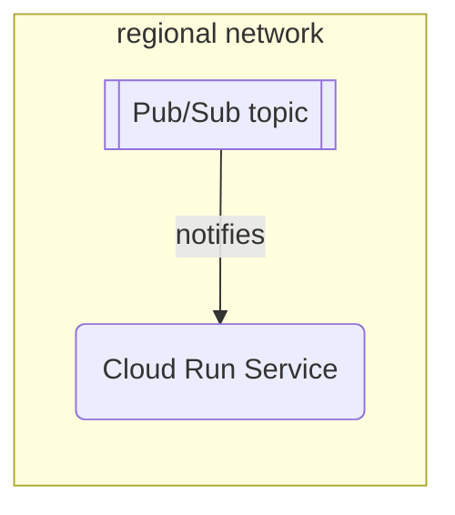

# `cloudevent-trigger`



This module abstracts regionalizied event-triggered services.
It's intended to be used with the "Broker" abstraction is described by the sibling [`cloudevent-broker`](./../cloudevent-broker/) module.

The intended usage of this module for consuming events is something like this:

```hcl
// Create a network with several regional subnets
module "networking" {
  source = "chainguard-dev/common/infra//modules/networking"

  name       = "my-networking"
  project_id = var.project_id
  regions    = [...]
}

// Create the Broker abstraction.
module "cloudevent-broker" {
  source = "chainguard-dev/common/infra//modules/cloudevent-broker"

  name       = "my-broker"
  project_id = var.project_id
  regions    = module.networking.regional-networks
}

module "bar-service" {
  source = "chainguard-dev/common/infra//modules/regional-go-service"

  project_id = var.project_id
  name       = "bar"
  regions    = module.networking.regional-networks

  service_account = google_service_account.bar.email
  containers = {
    "foo" = {
      source = {
        working_dir = path.module
        importpath  = "./cmd/foo"
      }
      ports = [{ container_port = 8080 }]
    }
  }
}

// Set up regionalized triggers to deliver filtered events from our regionalized
// brokers to our regionalized consumer services.
module "cloudevent-trigger" {
  for_each = module.networking.regional-networks

  source = "chainguard-dev/common/infra//modules/cloudevent-trigger"

  name       = "bar"
  project_id = var.project_id
  broker     = module.cloudevent-broker.broker[each.key]

  // Only trigger on bar-type events.
  filter     = { "type" : "dev.chainguard.bar" }

  // Only trigger on events with subject matching "foo/*"
  filter_prefix = { "subject": "foo/" }

  depends_on = [module.bar-service]
  private-service = {
    region = each.key
    name   = module.bar-service.names[each.key]
  }
}
```

<!-- BEGIN_TF_DOCS -->
## Requirements

No requirements.

## Providers

| Name | Version |
|------|---------|
| <a name="provider_google"></a> [google](#provider\_google) | n/a |
| <a name="provider_google-beta"></a> [google-beta](#provider\_google-beta) | n/a |
| <a name="provider_random"></a> [random](#provider\_random) | n/a |

## Modules

| Name | Source | Version |
|------|--------|---------|
| <a name="module_authorize-delivery"></a> [authorize-delivery](#module\_authorize-delivery) | ../authorize-private-service | n/a |

## Resources

| Name | Type |
|------|------|
| [google-beta_google_project_service_identity.pubsub](https://registry.terraform.io/providers/hashicorp/google-beta/latest/docs/resources/google_project_service_identity) | resource |
| [google_pubsub_subscription.dead-letter-pull-sub](https://registry.terraform.io/providers/hashicorp/google/latest/docs/resources/pubsub_subscription) | resource |
| [google_pubsub_subscription.this](https://registry.terraform.io/providers/hashicorp/google/latest/docs/resources/pubsub_subscription) | resource |
| [google_pubsub_subscription_iam_binding.allow-pubsub-to-ack](https://registry.terraform.io/providers/hashicorp/google/latest/docs/resources/pubsub_subscription_iam_binding) | resource |
| [google_pubsub_topic.dead-letter](https://registry.terraform.io/providers/hashicorp/google/latest/docs/resources/pubsub_topic) | resource |
| [google_pubsub_topic_iam_binding.allow-pubsub-to-send-to-dead-letter](https://registry.terraform.io/providers/hashicorp/google/latest/docs/resources/pubsub_topic_iam_binding) | resource |
| [google_service_account.this](https://registry.terraform.io/providers/hashicorp/google/latest/docs/resources/service_account) | resource |
| [google_service_account_iam_binding.allow-pubsub-to-mint-tokens](https://registry.terraform.io/providers/hashicorp/google/latest/docs/resources/service_account_iam_binding) | resource |
| [random_string.suffix](https://registry.terraform.io/providers/hashicorp/random/latest/docs/resources/string) | resource |

## Inputs

| Name | Description | Type | Default | Required |
|------|-------------|------|---------|:--------:|
| <a name="input_ack_deadline_seconds"></a> [ack\_deadline\_seconds](#input\_ack\_deadline\_seconds) | The deadline for acking a message. | `number` | `300` | no |
| <a name="input_broker"></a> [broker](#input\_broker) | The name of the pubsub topic we are using as a broker. | `string` | n/a | yes |
| <a name="input_filter"></a> [filter](#input\_filter) | A Knative Trigger-style filter over the cloud event attributes.<br><br>This is normally used to filter relevant event types, for example:<br><br>  { "type" : "dev.chainguard.foo" }<br><br>In this case, only events with a type attribute of "dev.chainguard.foo" will be delivered. | `map(string)` | `{}` | no |
| <a name="input_filter_has_attributes"></a> [filter\_has\_attributes](#input\_filter\_has\_attributes) | A Knative Trigger-style filter over the cloud event attribute prefixes.<br><br>This can be used to filter on the presence of an event attribute, for example:<br><br>  ["location"]<br><br>In this case, any event with a type attribute of "location" will be delivered. | `list(string)` | `[]` | no |
| <a name="input_filter_not_has_attributes"></a> [filter\_not\_has\_attributes](#input\_filter\_not\_has\_attributes) | A Knative Trigger-style filter over the cloud event attribute prefixes.<br><br>This can be used to filter on the absence of an event attribute, for example:<br><br>  ["location"]<br><br>In this case, any event with a type attribute of "location" will NOT be delivered. | `list(string)` | `[]` | no |
| <a name="input_filter_prefix"></a> [filter\_prefix](#input\_filter\_prefix) | A Knative Trigger-style filter over the cloud event attribute prefixes.<br><br>This can be used to filter relevant event types, for example:<br><br>  { "type" : "dev.chainguard." }<br><br>In this case, any event with a type attribute that starts with "dev.chainguard." will be delivered. | `map(string)` | `{}` | no |
| <a name="input_max_delivery_attempts"></a> [max\_delivery\_attempts](#input\_max\_delivery\_attempts) | The maximum number of delivery attempts for any event. | `number` | `20` | no |
| <a name="input_maximum_backoff"></a> [maximum\_backoff](#input\_maximum\_backoff) | The maximum delay between consecutive deliveries of a given message. | `number` | `600` | no |
| <a name="input_minimum_backoff"></a> [minimum\_backoff](#input\_minimum\_backoff) | The minimum delay between consecutive deliveries of a given message. | `number` | `10` | no |
| <a name="input_name"></a> [name](#input\_name) | n/a | `string` | n/a | yes |
| <a name="input_notification_channels"></a> [notification\_channels](#input\_notification\_channels) | List of notification channels to alert. | `list(string)` | n/a | yes |
| <a name="input_private-service"></a> [private-service](#input\_private-service) | The private cloud run service that is subscribing to these events. | <pre>object({<br>    name   = string<br>    region = string<br>  })</pre> | n/a | yes |
| <a name="input_project_id"></a> [project\_id](#input\_project\_id) | n/a | `string` | n/a | yes |
| <a name="input_raw_filter"></a> [raw\_filter](#input\_raw\_filter) | Raw PubSub filter to apply, ignores other variables. https://cloud.google.com/pubsub/docs/subscription-message-filter#filtering_syntax | `string` | `""` | no |

## Outputs

| Name | Description |
|------|-------------|
| <a name="output_dead-letter-broker"></a> [dead-letter-broker](#output\_dead-letter-broker) | The name of the dead-letter topic, which is used to store events that could not be delivered. |
<!-- END_TF_DOCS -->
