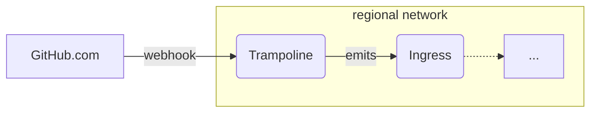

# `github-events`

This module provisions infrastructure to listen to webhook events from GitHub and
publish them to a broker.



More information on GitHub webhooks:
- https://docs.github.com/en/webhooks/using-webhooks/validating-webhook-deliveries
- https://docs.github.com/en/webhooks/webhook-events-and-payloads

Events are published as they are received from GitHub, and are not transformed in
any way. The events are published to a broker, which can be used to fan out the
events to other services, or filter based on their type.

You can use this with `cloudevent-recorder` to record GitHub events to a BigQuery table.

CloudEvent types are derived from the GitHub event type, and are prefixed with
`dev.chainguard.github`. For example, the `push` event is published as
`dev.chainguard.github.push`.

```hcl
// Create a network with several regional subnets
module "networking" {
  source = "chainguard-dev/common/infra//modules/networking"

  name       = "my-networking"
  project_id = var.project_id
  regions    = [...]
}

// Create the Broker abstraction.
module "cloudevent-broker" {
  source = "chainguard-dev/common/infra//modules/cloudevent-broker"

  name       = "my-broker"
  project_id = var.project_id
  regions    = module.networking.regional-networks
}

// Forward events to the broker.
module "github-events" {
  source = "./modules/github-events"

  project_id = var.project_id
  name       = "github-events"
  regions    = module.networking.regional-networks
  ingress    = module.cloudevent-broker.ingress

  // Which user is allowed to populate webhook secret values.
  secret_version_adder = "user:you@company.biz"
}
```

After applying this, generate a random secret value and add it to the GitHub
webhook config, and populate the secret version in the GCP Secret Manager.

## Using with `serverless-gclb`

To expose the service to the internet for production, you should use `serverless-gclb` to create a load-balanced public endpoint. This is the endpoint where GitHub will be configured to send webhook requests.

```hcl

data "google_dns_managed_zone" "top-level-zone" { name = "your-top-level-zone" }

module "serverless-gclb" {
  source = "chainguard-dev/common/infra//modules/serverless-gclb"

  name       = "github-events"
  project_id = var.project_id
  dns_zone   = data.google_dns_managed_zone.top-level-zone.name

  // Regions are all of the places that we have backends deployed.
  // Regions must be removed from serving before they are torn down.
  regions         = keys(module.networking.regional-networks)
  serving_regions = keys(module.networking.regional-networks)

  public-services = {
    // Matches github-events module name.
    "github.yourdomain.com" = { name = "github-events" }
  }
}
```

## Using with `INGRESS_TRAFFIC_ALL`

During development you may want to expose the service directly to the internet, without using a load balancer. This is useful for testing and development, but is **not recommended in production.**

```hcl
module "github-events" {
  source = "./modules/github-events"

  project_id = var.project_id
  name       = "github-events"
  regions    = module.networking.regional-networks
  ingress    = module.cloudevent-broker.ingress

  service-ingress = "INGRESS_TRAFFIC_ALL" // Expose the service to the internet.
}
```

The `public-urls` output will be populated with the `.run.app` URL for each regional service, which can be used to configure the GitHub webhook for testing.

## Using with `cloudevent-recorder`

The event payloads produced by this module are the full GitHub webhook payloads, and are not transformed in any way. If you want to record these events using `cloudevent-recorder`, you must set `ignore_unknown_fields`, since event payloads will not match the schema.

The schemas that describe which fields get recorded are defined in `./schemas/event_types.go`, and the BQ schemas are generated using `./cmd/schemagen`. To add fields or new types, modify the `event_types.go` file and run `go generate ./...`.

<!-- BEGIN_TF_DOCS -->
## Requirements

No requirements.

## Providers

| Name | Version |
|------|---------|
| <a name="provider_google"></a> [google](#provider\_google) | n/a |
| <a name="provider_random"></a> [random](#provider\_random) | n/a |

## Modules

| Name | Source | Version |
|------|--------|---------|
| <a name="module_dashboard"></a> [dashboard](#module\_dashboard) | ../dashboard | n/a |
| <a name="module_http"></a> [http](#module\_http) | ../dashboard/sections/http | n/a |
| <a name="module_layout"></a> [layout](#module\_layout) | ../dashboard/sections/layout | n/a |
| <a name="module_logs"></a> [logs](#module\_logs) | ../dashboard/sections/logs | n/a |
| <a name="module_resources"></a> [resources](#module\_resources) | ../dashboard/sections/resources | n/a |
| <a name="module_this"></a> [this](#module\_this) | ../regional-go-service | n/a |
| <a name="module_trampoline-emits-events"></a> [trampoline-emits-events](#module\_trampoline-emits-events) | ../authorize-private-service | n/a |
| <a name="module_webhook-secret"></a> [webhook-secret](#module\_webhook-secret) | ../secret | n/a |
| <a name="module_width"></a> [width](#module\_width) | ../dashboard/sections/width | n/a |

## Resources

| Name | Type |
|------|------|
| [google_service_account.service](https://registry.terraform.io/providers/hashicorp/google/latest/docs/resources/service_account) | resource |
| [random_string.service-suffix](https://registry.terraform.io/providers/hashicorp/random/latest/docs/resources/string) | resource |
| [google_cloud_run_v2_service.this](https://registry.terraform.io/providers/hashicorp/google/latest/docs/data-sources/cloud_run_v2_service) | data source |

## Inputs

| Name | Description | Type | Default | Required |
|------|-------------|------|---------|:--------:|
| <a name="input_additional_webhook_secrets"></a> [additional\_webhook\_secrets](#input\_additional\_webhook\_secrets) | Additional secrets to be used by the service.<br/><br/>- key: Local identifier for the secret. This will be prefixed with WEBHOOK\_SECRET\_ in the service's environment vars.<br/>- secret: The name of the secret in Cloud Secret Manager. Format: {secretName} if the secret is in the same project. projects/{project}/secrets/{secretName} if the secret is in a different project.<br/>- version: The version of the secret to use. Can be a number or 'latest'.<br/><br/>See https://registry.terraform.io/providers/hashicorp/google/latest/docs/resources/cloud_run_v2_service#nested_env for related documentation. | <pre>map(object({<br/>    secret  = string<br/>    version = string<br/>  }))</pre> | n/a | yes |
| <a name="input_deletion_protection"></a> [deletion\_protection](#input\_deletion\_protection) | Whether to enable delete protection for the service. | `bool` | `true` | no |
| <a name="input_enable_profiler"></a> [enable\_profiler](#input\_enable\_profiler) | Enable cloud profiler. | `bool` | `false` | no |
| <a name="input_ingress"></a> [ingress](#input\_ingress) | An object holding the name of the ingress service, which can be used to authorize callers to publish cloud events. | <pre>object({<br/>    name = string<br/>  })</pre> | n/a | yes |
| <a name="input_max_delivery_attempts"></a> [max\_delivery\_attempts](#input\_max\_delivery\_attempts) | The maximum number of delivery attempts for any event. | `number` | `5` | no |
| <a name="input_name"></a> [name](#input\_name) | n/a | `string` | n/a | yes |
| <a name="input_notification_channels"></a> [notification\_channels](#input\_notification\_channels) | List of notification channels to alert. | `list(string)` | n/a | yes |
| <a name="input_project_id"></a> [project\_id](#input\_project\_id) | n/a | `string` | n/a | yes |
| <a name="input_regions"></a> [regions](#input\_regions) | A map from region names to a network and subnetwork. The bucket must be in one of these regions. | <pre>map(object({<br/>    network = string<br/>    subnet  = string<br/>  }))</pre> | n/a | yes |
| <a name="input_require_squad"></a> [require\_squad](#input\_require\_squad) | Whether to require squad variable to be specified | `bool` | `false` | no |
| <a name="input_secret_version_adder"></a> [secret\_version\_adder](#input\_secret\_version\_adder) | The user allowed to populate new webhook secret versions. | `string` | n/a | yes |
| <a name="input_service-ingress"></a> [service-ingress](#input\_service-ingress) | Which type of ingress traffic to accept for the service (see regional-go-service). Valid values are:<br/><br/>- INGRESS\_TRAFFIC\_ALL accepts all traffic, enabling the public .run.app URL for the service<br/>- INGRESS\_TRAFFIC\_INTERNAL\_LOAD\_BALANCER accepts traffic only from a load balancer | `string` | `"INGRESS_TRAFFIC_INTERNAL_LOAD_BALANCER"` | no |
| <a name="input_squad"></a> [squad](#input\_squad) | squad label to apply to the service. | `string` | `""` | no |

## Outputs

| Name | Description |
|------|-------------|
| <a name="output_public-urls"></a> [public-urls](#output\_public-urls) | Map of region to public URL for the service, if service-ingress is INGRESS\_TRAFFIC\_ALL. |
| <a name="output_recorder-schemas"></a> [recorder-schemas](#output\_recorder-schemas) | READ THIS BEFORE YOU EDIT!!! These schemas are used to generate bigquery table names used by the recorder. If you are adding a schema you're fine to proceed. If you are changing the name of a schema, or removing a schema, terraform will try to delete the old schema. The recorders have a parameter `deletion_protection` enabled by default so terraform will fail to delete the schema.  The proper process for deleting or modifying a schema is in this playbook https://eng.inky.wtf/docs/infra/playbooks/schema-names/ |
<!-- END_TF_DOCS -->
