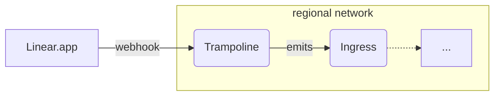

# `linear-events`

This module provisions infrastructure to listen to webhook events from Linear and
publish them to a broker.



More information on Linear webhooks:
- https://linear.app/developers/webhooks

Events are published as they are received from Linear, and are not transformed in
any way. The events are published to a broker, which can be used to fan out the
events to other services, or filter based on their type.

You can use this with `cloudevent-recorder` to record Linear events to a BigQuery table.

CloudEvent types are derived from the Linear event type, and are prefixed with
`dev.chainguard.linear`. For example, the `Issue` event is published as
`dev.chainguard.linear.issue`.

```hcl
module "linear-events" {
  source = "./modules/linear-events"

  project_id = var.project_id
  name       = "linear-events"
  regions    = module.networking.regional-networks
  ingress    = module.cloudevent-broker.ingress

  secret_version_adder = "user:you@company.biz"
}
```

After applying this, generate a random secret value and configure it in both the
Linear webhook settings and the GCP Secret Manager secret.

## Using with `cloudevent-recorder`

The event payloads produced by this module are the full Linear webhook payloads,
and are not transformed in any way. If you want to record these events using
`cloudevent-recorder`, you should set `ignore_unknown_values`, since event
payloads may contain fields not in the schema.

<!-- BEGIN_TF_DOCS -->
## Requirements

No requirements.

## Providers

| Name | Version |
|------|---------|
| <a name="provider_google"></a> [google](#provider\_google) | n/a |
| <a name="provider_random"></a> [random](#provider\_random) | n/a |

## Modules

| Name | Source | Version |
|------|--------|---------|
| <a name="module_this"></a> [this](#module\_this) | ../regional-go-service | n/a |
| <a name="module_trampoline-emits-events"></a> [trampoline-emits-events](#module\_trampoline-emits-events) | ../authorize-private-service | n/a |
| <a name="module_webhook-secret"></a> [webhook-secret](#module\_webhook-secret) | ../secret | n/a |

## Resources

| Name | Type |
|------|------|
| [google_service_account.service](https://registry.terraform.io/providers/hashicorp/google/latest/docs/resources/service_account) | resource |
| [random_string.service-suffix](https://registry.terraform.io/providers/hashicorp/random/latest/docs/resources/string) | resource |
| [google_cloud_run_v2_service.this](https://registry.terraform.io/providers/hashicorp/google/latest/docs/data-sources/cloud_run_v2_service) | data source |

## Inputs

| Name | Description | Type | Default | Required |
|------|-------------|------|---------|:--------:|
| <a name="input_additional_webhook_secrets"></a> [additional\_webhook\_secrets](#input\_additional\_webhook\_secrets) | Additional secrets to be used by the service. | <pre>map(object({<br/>    secret  = string<br/>    version = string<br/>  }))</pre> | `{}` | no |
| <a name="input_create_placeholder_version"></a> [create\_placeholder\_version](#input\_create\_placeholder\_version) | Whether to create a placeholder secret version to avoid bad reference on first deploy. | `bool` | `false` | no |
| <a name="input_deletion_protection"></a> [deletion\_protection](#input\_deletion\_protection) | Whether to enable delete protection for the service. | `bool` | `true` | no |
| <a name="input_enable_profiler"></a> [enable\_profiler](#input\_enable\_profiler) | Enable cloud profiler. | `bool` | `false` | no |
| <a name="input_ingress"></a> [ingress](#input\_ingress) | An object holding the name of the ingress service, which can be used to authorize callers to publish cloud events. | <pre>object({<br/>    name = string<br/>  })</pre> | n/a | yes |
| <a name="input_name"></a> [name](#input\_name) | n/a | `string` | n/a | yes |
| <a name="input_notification_channels"></a> [notification\_channels](#input\_notification\_channels) | List of notification channels to alert. | `list(string)` | n/a | yes |
| <a name="input_product"></a> [product](#input\_product) | Product label to apply to the service. | `string` | `"unknown"` | no |
| <a name="input_project_id"></a> [project\_id](#input\_project\_id) | n/a | `string` | n/a | yes |
| <a name="input_provisioner"></a> [provisioner](#input\_provisioner) | The member-style identity of the account provisioning resources in this environment (e.g. serviceAccount:…). When set, it is granted access to the webhook secret so placeholder versions can be created. | `string` | `""` | no |
| <a name="input_regions"></a> [regions](#input\_regions) | A map from region names to a network and subnetwork. | <pre>map(object({<br/>    network = string<br/>    subnet  = string<br/>  }))</pre> | n/a | yes |
| <a name="input_secret_version_adder"></a> [secret\_version\_adder](#input\_secret\_version\_adder) | The user allowed to populate new webhook secret versions. | `string` | n/a | yes |
| <a name="input_service-ingress"></a> [service-ingress](#input\_service-ingress) | Which type of ingress traffic to accept for the service. Valid values are:<br/><br/>- INGRESS\_TRAFFIC\_ALL accepts all traffic, enabling the public .run.app URL for the service<br/>- INGRESS\_TRAFFIC\_INTERNAL\_LOAD\_BALANCER accepts traffic only from a load balancer | `string` | `"INGRESS_TRAFFIC_INTERNAL_LOAD_BALANCER"` | no |
| <a name="input_team"></a> [team](#input\_team) | Team label to apply to resources. | `string` | n/a | yes |

## Outputs

| Name | Description |
|------|-------------|
| <a name="output_public-urls"></a> [public-urls](#output\_public-urls) | Map of region to public URL for the service, if service-ingress is INGRESS\_TRAFFIC\_ALL. |
| <a name="output_recorder-schemas"></a> [recorder-schemas](#output\_recorder-schemas) | n/a |
<!-- END_TF_DOCS -->
