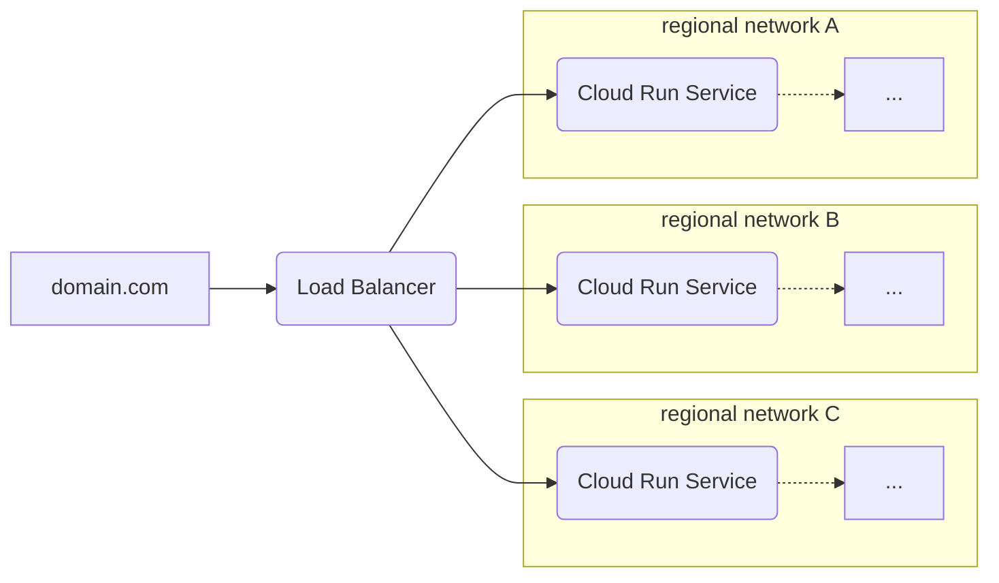

# `serverless-gclb-cbd`

This module provisions a Google Cloud Load Balancer (GCLB) that sits in front of
some number of regionalized Cloud Run services.

Difference from the `serverless-gclb-cbd` is that
lifecycle.create-before-destory is eanbled on the url_map
resource. Which is needed sometimes to fix deployments.



```hcl
// Create a network with several regional subnets
module "networking" {
  source = "chainguard-dev/common/infra//modules/networking"

  name       = "my-networking"
  project_id = var.project_id
  regions    = [...]
}

resource "google_dns_managed_zone" "top-level-zone" {
  project     = var.project_id
  name        = "example-com"
  dns_name    = "example.com."
}

module "serverless-gclb" {
  source = "chainguard-dev/common/infra//modules/serverless-gclb"

  name       = "my-gclb"
  project_id = var.project_id
  dns_zone   = google_dns_managed_zone.top-level-zone.name

  // Regions are all of the places that we have backends deployed.
  // Regions must be removed from serving before they are torn down.
  regions         = keys(module.networking.regional-networks)
  serving_regions = keys(module.networking.regional-networks)

  public-services = {
    "foo.example.com" = {
      name = "my-foo-service" // e.g. from regional-go-service
    }
  }
}
```

## Migrating an existing proxy to a certificate map

A target HTTPS proxy must always have at least one SSL certificate or a
certificate map attached, and the Google provider updates `ssl_certificates`
before `certificate_map`. Flipping an existing proxy straight from per-hostname
certs to a map in a single apply therefore strips the certs before the map is
attached, and GCP rejects it:

```
Error 412: Certificate Map or at least 1 SSL certificate must be specified
for setting SSL certificates in TargetHttpsProxy.
```

Use `retain_managed_certificates` to migrate in two applies, keeping a valid
certificate source attached the whole time:

1. Set `certificate_map` and `retain_managed_certificates = true`. Both the
   per-hostname certs and the map are attached; the map serves TLS.
2. Set `retain_managed_certificates = false`. The per-hostname certs are
   dropped; the map already satisfies the proxy, so there is no gap.

Rolling back is the mirror image, and is **not** symmetric with a fresh
deployment. Removing `certificate_map` recreates the per-hostname managed certs,
which take 15-60+ minutes to reach ACTIVE; detach the map before they are ACTIVE
and the proxy serves from provisioning certs, so TLS fails. Roll back in two
applies:

1. Set `retain_managed_certificates = true`. The per-hostname certs are
   recreated and attached alongside the still-present map, which keeps serving.
2. Wait for the recreated certificates to report ACTIVE, then set
   `certificate_map = ""`. The map is detached and the ACTIVE certs serve.

Greenfield proxies created with `certificate_map` set (and
`retain_managed_certificates` left false) need none of this; they are born with
only the map.

<!-- BEGIN_TF_DOCS -->
## Requirements

| Name | Version |
| ---- | ------- |
| <a name="requirement_google"></a> [google](#requirement\_google) | >= 7.34.0 |

## Providers

| Name | Version |
| ---- | ------- |
| <a name="provider_google"></a> [google](#provider\_google) | >= 7.34.0 |

## Modules

No modules.

## Resources

| Name | Type |
| ---- | ---- |
| [google_compute_backend_service.public-services](https://registry.terraform.io/providers/hashicorp/google/latest/docs/resources/compute_backend_service) | resource |
| [google_compute_global_address.this](https://registry.terraform.io/providers/hashicorp/google/latest/docs/resources/compute_global_address) | resource |
| [google_compute_global_address.this-v6](https://registry.terraform.io/providers/hashicorp/google/latest/docs/resources/compute_global_address) | resource |
| [google_compute_global_forwarding_rule.this](https://registry.terraform.io/providers/hashicorp/google/latest/docs/resources/compute_global_forwarding_rule) | resource |
| [google_compute_global_forwarding_rule.this-v6](https://registry.terraform.io/providers/hashicorp/google/latest/docs/resources/compute_global_forwarding_rule) | resource |
| [google_compute_managed_ssl_certificate.public-service](https://registry.terraform.io/providers/hashicorp/google/latest/docs/resources/compute_managed_ssl_certificate) | resource |
| [google_compute_region_network_endpoint_group.regional-backends](https://registry.terraform.io/providers/hashicorp/google/latest/docs/resources/compute_region_network_endpoint_group) | resource |
| [google_compute_ssl_policy.ssl_policy](https://registry.terraform.io/providers/hashicorp/google/latest/docs/resources/compute_ssl_policy) | resource |
| [google_compute_target_https_proxy.public-service](https://registry.terraform.io/providers/hashicorp/google/latest/docs/resources/compute_target_https_proxy) | resource |
| [google_compute_url_map.public-service](https://registry.terraform.io/providers/hashicorp/google/latest/docs/resources/compute_url_map) | resource |
| [google_dns_record_set.public-service](https://registry.terraform.io/providers/hashicorp/google/latest/docs/resources/dns_record_set) | resource |
| [google_dns_record_set.public-service-v6](https://registry.terraform.io/providers/hashicorp/google/latest/docs/resources/dns_record_set) | resource |
| [google_client_openid_userinfo.me](https://registry.terraform.io/providers/hashicorp/google/latest/docs/data-sources/client_openid_userinfo) | data source |

## Inputs

| Name | Description | Type | Default | Required |
| ---- | ----------- | ---- | ------- | :------: |
| <a name="input_certificate_map"></a> [certificate\_map](#input\_certificate\_map) | Optional Certificate Manager certificate map id, formatted as "//certificatemanager.googleapis.com/projects/.../certificateMaps/...". When set, the HTTPS proxy serves TLS from this map and the module creates no per-hostname managed SSL certificates, escaping the 15-certificate-per-proxy limit (e.g. with a wildcard certificate). Create the map in an earlier apply than the one that sets this, so its id is known at plan time. When empty (the default), the module keeps its per-hostname managed-certificate behaviour. Migrating an existing proxy between the two modes is a two-apply operation, see retain\_managed\_certificates and the module README. | `string` | `""` | no |
| <a name="input_dns_zone"></a> [dns\_zone](#input\_dns\_zone) | The managed DNS zone in which to create record sets. | `string` | n/a | yes |
| <a name="input_enable_ipv6"></a> [enable\_ipv6](#input\_enable\_ipv6) | Enable dualstack ipv6+ipv4 support on the edge/public loadbalancer end point. When false (default), ipv4-only is deployed. | `bool` | `false` | no |
| <a name="input_forwarding_rule_load_balancing"></a> [forwarding\_rule\_load\_balancing](#input\_forwarding\_rule\_load\_balancing) | n/a | <pre>object({<br/>    external_managed_backend_bucket_migration_state              = optional(string, null)<br/>    external_managed_backend_bucket_migration_testing_percentage = optional(number, null)<br/>    load_balancing_scheme                                        = optional(string, "EXTERNAL")<br/>  })</pre> | `{}` | no |
| <a name="input_iap"></a> [iap](#input\_iap) | IAP configuration for the load balancer. | <pre>object({<br/>    oauth2_client_id     = optional(string, null)<br/>    oauth2_client_secret = optional(string, null)<br/>    enabled              = bool<br/>  })</pre> | `null` | no |
| <a name="input_name"></a> [name](#input\_name) | n/a | `string` | n/a | yes |
| <a name="input_notification_channels"></a> [notification\_channels](#input\_notification\_channels) | The set of notification channels to which to send alerts. | `list(string)` | `[]` | no |
| <a name="input_product"></a> [product](#input\_product) | Product label to apply to the service. | `string` | `"unknown"` | no |
| <a name="input_project_id"></a> [project\_id](#input\_project\_id) | n/a | `string` | n/a | yes |
| <a name="input_public-services"></a> [public-services](#input\_public-services) | A map from hostnames (managed by dns\_zone), to the name of the regionalized cloud run service to which the hostname should be routed.  A managed SSL certificate will be created for each hostname (unless certificate\_map is set), and a DNS record set will be created for each hostname pointing to the load balancer's global IP address.<br/><br/>external\_managed\_migration\_state: The migration state for the load balancer, [PREPARE, TEST\_BY\_PERCENTAGE, and TEST\_ALL\_TRAFFIC].<br/>external\_managed\_migration\_testing\_percentage: The percentage of traffic to route to new load balancer, [0, 100].<br/>load\_balancing\_scheme: The default load balancing scheme to use. | <pre>map(object({<br/>    name                                          = string<br/>    disabled                                      = optional(bool, false)<br/>    external_managed_migration_state              = optional(string, null)<br/>    external_managed_migration_testing_percentage = optional(number, null)<br/>    load_balancing_scheme                         = optional(string, "EXTERNAL")<br/>    connection_draining_timeout_sec               = optional(number, 300)<br/>  }))</pre> | n/a | yes |
| <a name="input_regions"></a> [regions](#input\_regions) | The set of regions containing backends for the load balancer (regions must be added here before they can be added as serving regions). | `list` | <pre>[<br/>  "us-central1"<br/>]</pre> | no |
| <a name="input_retain_managed_certificates"></a> [retain\_managed\_certificates](#input\_retain\_managed\_certificates) | Only meaningful when certificate\_map is set. When true, the per-hostname managed SSL certificates are still created and stay attached to the HTTPS proxy alongside the certificate map, which is the legal intermediate state for migrating an existing proxy without a TLS gap. A target HTTPS proxy must always have >=1 SSL certificate or a certificate map, and the provider strips ssl\_certificates before attaching the map, so flipping straight from certs to map in one apply is rejected (Error 412). Instead set certificate\_map with this true in one apply (both attached), then set this back to false in a follow-up apply to drop the per-hostname certs. Roll back the same way in reverse, waiting for the recreated certs to be ACTIVE before removing the map. See the module README. Defaults to false, so greenfield proxies and existing callers are unaffected. | `bool` | `false` | no |
| <a name="input_security-policy"></a> [security-policy](#input\_security-policy) | The security policy associated with the backend service. | `string` | `null` | no |
| <a name="input_serving_regions"></a> [serving\_regions](#input\_serving\_regions) | The set of regions with backends suitable for serving traffic from the load balancer (regions must be removed from here before they can be removed from regions). | `list` | <pre>[<br/>  "us-central1"<br/>]</pre> | no |
| <a name="input_team"></a> [team](#input\_team) | team label to apply to the service. | `string` | n/a | yes |

## Outputs

No outputs.
<!-- END_TF_DOCS -->
