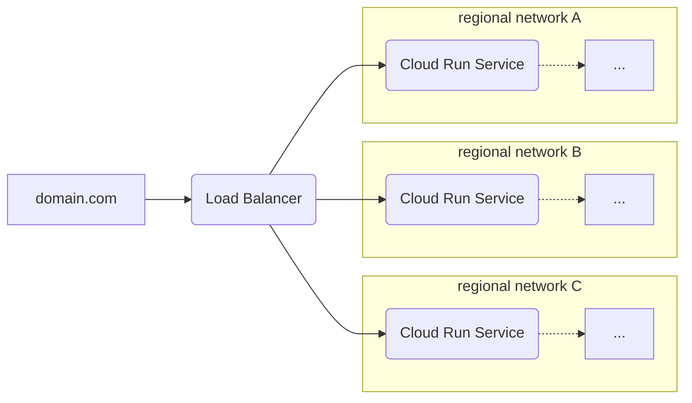

# `serverless-gclb`

This module provisions a Google Cloud Load Balancer (GCLB) that sits in front of
some number of regionalized Cloud Run services.



```hcl
// Create a network with several regional subnets
module "networking" {
  source = "chainguard-dev/common/infra//modules/networking"

  name       = "my-networking"
  project_id = var.project_id
  regions    = [...]
}

resource "google_dns_managed_zone" "top-level-zone" {
  project     = var.project_id
  name        = "example-com"
  dns_name    = "example.com."
}

module "serverless-gclb" {
  source = "chainguard-dev/common/infra//modules/serverless-gclb"

  name       = "my-gclb"
  project_id = var.project_id
  dns_zone   = google_dns_managed_zone.top-level-zone.name

  // Regions are all of the places that we have backends deployed.
  // Regions must be removed from serving before they are torn down.
  regions         = keys(module.networking.regional-networks)
  serving_regions = keys(module.networking.regional-networks)

  public-services = {
    "foo.example.com" = {
      name = "my-foo-service" // e.g. from regional-go-service
    }
  }
}
```

<!-- BEGIN_TF_DOCS -->
## Requirements

No requirements.

## Providers

| Name | Version |
|------|---------|
| <a name="provider_google"></a> [google](#provider\_google) | n/a |

## Modules

No modules.

## Resources

| Name | Type |
|------|------|
| [google_compute_backend_service.public-services](https://registry.terraform.io/providers/hashicorp/google/latest/docs/resources/compute_backend_service) | resource |
| [google_compute_global_address.this](https://registry.terraform.io/providers/hashicorp/google/latest/docs/resources/compute_global_address) | resource |
| [google_compute_global_forwarding_rule.this](https://registry.terraform.io/providers/hashicorp/google/latest/docs/resources/compute_global_forwarding_rule) | resource |
| [google_compute_managed_ssl_certificate.public-service](https://registry.terraform.io/providers/hashicorp/google/latest/docs/resources/compute_managed_ssl_certificate) | resource |
| [google_compute_region_network_endpoint_group.regional-backends](https://registry.terraform.io/providers/hashicorp/google/latest/docs/resources/compute_region_network_endpoint_group) | resource |
| [google_compute_target_https_proxy.public-service](https://registry.terraform.io/providers/hashicorp/google/latest/docs/resources/compute_target_https_proxy) | resource |
| [google_compute_url_map.public-service](https://registry.terraform.io/providers/hashicorp/google/latest/docs/resources/compute_url_map) | resource |
| [google_dns_record_set.public-service](https://registry.terraform.io/providers/hashicorp/google/latest/docs/resources/dns_record_set) | resource |
| [google_client_openid_userinfo.me](https://registry.terraform.io/providers/hashicorp/google/latest/docs/data-sources/client_openid_userinfo) | data source |

## Inputs

| Name | Description | Type | Default | Required |
|------|-------------|------|---------|:--------:|
| <a name="input_dns_zone"></a> [dns\_zone](#input\_dns\_zone) | The managed DNS zone in which to create record sets. | `string` | n/a | yes |
| <a name="input_iap"></a> [iap](#input\_iap) | IAP configuration for the load balancer. | <pre>object({<br>    oauth2_client_id     = string<br>    oauth2_client_secret = string<br>  })</pre> | `null` | no |
| <a name="input_name"></a> [name](#input\_name) | n/a | `string` | n/a | yes |
| <a name="input_notification_channels"></a> [notification\_channels](#input\_notification\_channels) | The set of notification channels to which to send alerts. | `list(string)` | `[]` | no |
| <a name="input_project_id"></a> [project\_id](#input\_project\_id) | n/a | `string` | n/a | yes |
| <a name="input_public-services"></a> [public-services](#input\_public-services) | A map from hostnames (managed by dns\_zone), to the name of the regionalized cloud run service to which the hostname should be routed.  A managed SSL certificate will be created for each hostname, and a DNS record set will be created for each hostname pointing to the load balancer's global IP address. | <pre>map(object({<br>    name     = string<br>    disabled = optional(bool, false)<br>  }))</pre> | n/a | yes |
| <a name="input_regions"></a> [regions](#input\_regions) | The set of regions containing backends for the load balancer (regions must be added here before they can be added as serving regions). | `list` | <pre>[<br>  "us-central1"<br>]</pre> | no |
| <a name="input_serving_regions"></a> [serving\_regions](#input\_serving\_regions) | The set of regions with backends suitable for serving traffic from the load balancer (regions must be removed from here before they can be removed from regions). | `list` | <pre>[<br>  "us-central1"<br>]</pre> | no |

## Outputs

No outputs.
<!-- END_TF_DOCS -->
