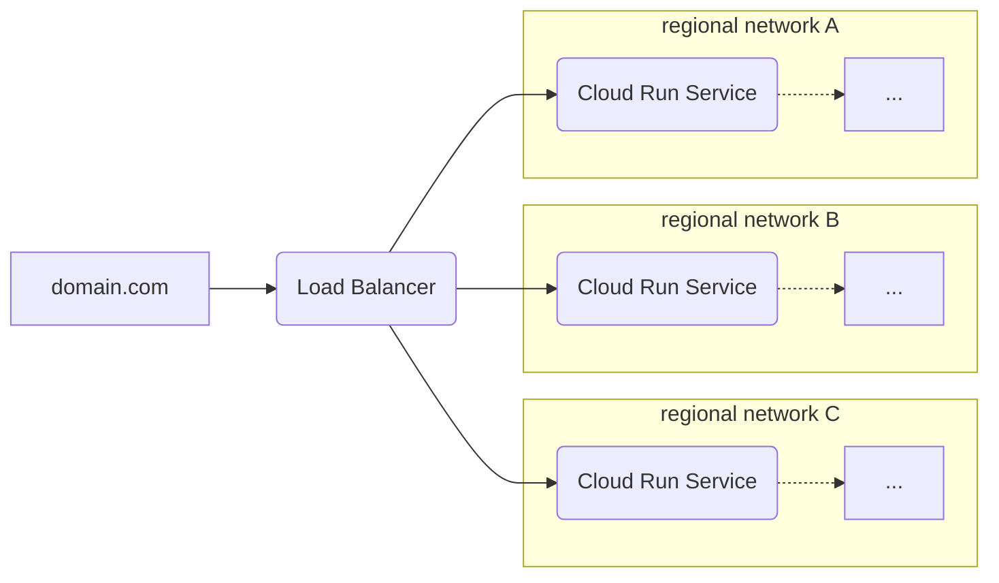

# `serverless-gclb`

This module provisions a Google Cloud Load Balancer (GCLB) that sits in front of
some number of regionalized Cloud Run services.


```mermaid
flowchart LR
    T[domain.com]
    T --> A

    A(Load Balancer)
    A  --> X
    A  --> Y
    A  --> Z

    subgraph "regional network C"
    X(Cloud Run Service)
    X -.-> L["..."]
    end

    subgraph "regional network B"
    Y(Cloud Run Service)
    Y -.-> M["..."]
    end

    subgraph "regional network A"
    Z(Cloud Run Service)
    Z -.-> N["..."]
    end
```

```hcl
// Create a network with several regional subnets
module "networking" {
  source = "chainguard-dev/common/infra//modules/networking"

  name       = "my-networking"
  project_id = var.project_id
  regions    = [...]
}

resource "google_dns_managed_zone" "top-level-zone" {
  project     = var.project_id
  name        = "example-com"
  dns_name    = "example.com."
}

module "serverless-gclb" {
  source = "chainguard-dev/common/infra//modules/serverless-gclb"

  name       = "my-gclb"
  project_id = var.project_id
  dns_zone   = google_dns_managed_zone.top-level-zone.name

  // Regions are all of the places that we have backends deployed.
  // Regions must be removed from serving before they are torn down.
  regions         = keys(module.networking.regional-networks)
  serving_regions = keys(module.networking.regional-networks)

  public-services = {
    "foo.example.com" = {
      name = "my-foo-service" // e.g. from regional-go-service
    }
  }

  // Hostnames served straight from a Cloud Storage bucket (through Cloud CDN
  // by default) rather than a Cloud Run service. The module creates the
  // backend bucket and nothing more: a bucket is public — its objects must be
  // readable by allUsers — unless the caller serves it to signed URLs only,
  // as downloads.example.com is below.
  buckets = {
    "static.example.com" = {
      name        = "my-static-content"
      bucket_name = google_storage_bucket.static.name
    }
    "downloads.example.com" = {
      name        = "my-downloads"
      bucket_name = google_storage_bucket.downloads.name
      cdn_policy  = { cache_mode = "USE_ORIGIN_HEADERS", signed_url_cache_max_age_sec = 31536000 }
    }
  }
}

// Serving downloads.example.com to signed URLs only: the caller attaches the
// signing key to the backend bucket the module exports, and lets Cloud CDN read
// the private bucket — which must already have had public read (allUsers)
// removed from its IAM and ACLs, as Cloud CDN's signed-URL guidance requires.
// Both steps may equally be done outside Terraform (gcloud compute
// backend-buckets add-signed-url-key; gcloud storage buckets add-iam-policy-
// binding), so the key value never enters Terraform's state.
resource "google_compute_backend_bucket_signed_url_key" "downloads" {
  name           = "downloads-key-1"
  key_value      = random_id.downloads_key.b64_url
  backend_bucket = module.serverless-gclb.backend_buckets["downloads.example.com"].name
}

// Cloud CDN fills a private bucket's cache as the project's cloud-cdn-fill
// service agent. GCP creates that agent once the first signed-URL key in the
// project has been attached, so the grant is ordered after the key or the
// first apply fails with an unknown principal.
resource "google_storage_bucket_iam_member" "downloads_cdn_fill" {
  bucket = google_storage_bucket.downloads.name
  role   = "roles/storage.objectViewer"
  member = "serviceAccount:service-${data.google_project.this.number}@cloud-cdn-fill.iam.gserviceaccount.com"

  depends_on = [google_compute_backend_bucket_signed_url_key.downloads]
}
```

## Migrating an existing proxy to a certificate map

A target HTTPS proxy must always have at least one SSL certificate or a
certificate map attached, and the Google provider updates `ssl_certificates`
before `certificate_map`. Flipping an existing proxy straight from per-hostname
certs to a map in a single apply therefore strips the certs before the map is
attached, and GCP rejects it:

```
Error 412: Certificate Map or at least 1 SSL certificate must be specified
for setting SSL certificates in TargetHttpsProxy.
```

Use `retain_managed_certificates` to migrate in two applies, keeping a valid
certificate source attached the whole time:

1. Set `certificate_map` and `retain_managed_certificates = true`. Both the
   per-hostname certs and the map are attached; the map serves TLS.
2. Set `retain_managed_certificates = false`. The per-hostname certs are
   dropped; the map already satisfies the proxy, so there is no gap.

Rolling back is the mirror image, and is **not** symmetric with a fresh
deployment. Removing `certificate_map` recreates the per-hostname managed certs,
which take 15-60+ minutes to reach ACTIVE; detach the map before they are ACTIVE
and the proxy serves from provisioning certs, so TLS fails. Roll back in two
applies:

1. Set `retain_managed_certificates = true`. The per-hostname certs are
   recreated and attached alongside the still-present map, which keeps serving.
2. Wait for the recreated certificates to report ACTIVE, then set
   `certificate_map = ""`. The map is detached and the ACTIVE certs serve.

Greenfield proxies created with `certificate_map` set (and
`retain_managed_certificates` left false) need none of this; they are born with
only the map.

<!-- BEGIN_TF_DOCS -->
## Requirements

| Name | Version |
|------|---------|
| <a name="requirement_google"></a> [google](#requirement\_google) | >= 7.34.0 |

## Providers

| Name | Version |
|------|---------|
| <a name="provider_google"></a> [google](#provider\_google) | 8.2.0 |

## Modules

No modules.

## Resources

| Name | Type |
|------|------|
| [google_compute_backend_bucket.buckets](https://registry.terraform.io/providers/hashicorp/google/latest/docs/resources/compute_backend_bucket) | resource |
| [google_compute_backend_service.public-services](https://registry.terraform.io/providers/hashicorp/google/latest/docs/resources/compute_backend_service) | resource |
| [google_compute_global_address.this](https://registry.terraform.io/providers/hashicorp/google/latest/docs/resources/compute_global_address) | resource |
| [google_compute_global_address.this-v6](https://registry.terraform.io/providers/hashicorp/google/latest/docs/resources/compute_global_address) | resource |
| [google_compute_global_forwarding_rule.this](https://registry.terraform.io/providers/hashicorp/google/latest/docs/resources/compute_global_forwarding_rule) | resource |
| [google_compute_global_forwarding_rule.this-v6](https://registry.terraform.io/providers/hashicorp/google/latest/docs/resources/compute_global_forwarding_rule) | resource |
| [google_compute_managed_ssl_certificate.bucket](https://registry.terraform.io/providers/hashicorp/google/latest/docs/resources/compute_managed_ssl_certificate) | resource |
| [google_compute_managed_ssl_certificate.public-service](https://registry.terraform.io/providers/hashicorp/google/latest/docs/resources/compute_managed_ssl_certificate) | resource |
| [google_compute_region_network_endpoint_group.regional-backends](https://registry.terraform.io/providers/hashicorp/google/latest/docs/resources/compute_region_network_endpoint_group) | resource |
| [google_compute_ssl_policy.ssl_policy](https://registry.terraform.io/providers/hashicorp/google/latest/docs/resources/compute_ssl_policy) | resource |
| [google_compute_target_https_proxy.public-service](https://registry.terraform.io/providers/hashicorp/google/latest/docs/resources/compute_target_https_proxy) | resource |
| [google_compute_url_map.public-service](https://registry.terraform.io/providers/hashicorp/google/latest/docs/resources/compute_url_map) | resource |
| [google_dns_record_set.bucket](https://registry.terraform.io/providers/hashicorp/google/latest/docs/resources/dns_record_set) | resource |
| [google_dns_record_set.bucket-v6](https://registry.terraform.io/providers/hashicorp/google/latest/docs/resources/dns_record_set) | resource |
| [google_dns_record_set.public-service](https://registry.terraform.io/providers/hashicorp/google/latest/docs/resources/dns_record_set) | resource |
| [google_dns_record_set.public-service-v6](https://registry.terraform.io/providers/hashicorp/google/latest/docs/resources/dns_record_set) | resource |
| [google_client_openid_userinfo.me](https://registry.terraform.io/providers/hashicorp/google/latest/docs/data-sources/client_openid_userinfo) | data source |
| [google_storage_bucket.buckets](https://registry.terraform.io/providers/hashicorp/google/latest/docs/data-sources/storage_bucket) | data source |

## Inputs

| Name | Description | Type | Default | Required |
|------|-------------|------|---------|:--------:|
| <a name="input_buckets"></a> [buckets](#input\_buckets) | A map from hostnames (managed by dns\_zone) to Cloud Storage buckets the hostname serves: content comes straight from the bucket through a backend bucket, and through Cloud CDN by default, rather than from a Cloud Run service. A managed SSL certificate and a DNS record are created for each hostname, as for public-services.<br/><br/>name: the name for the backend bucket, the certificate and the URL-map path matcher; unique across public-services and buckets.<br/>bucket\_name: the Cloud Storage bucket to serve, which must already exist.<br/>enable\_cdn: front the bucket with Cloud CDN (the default).<br/>disabled: keep the hostname's records but route nothing to it.<br/>cdn\_policy: optional Cloud CDN policy for the backend bucket; omitted, Cloud CDN applies its defaults.<br/><br/>A bucket is public unless the caller arranges otherwise: its objects must be readable by allUsers. To serve a bucket to signed URLs only, the caller attaches Cloud CDN signed-URL keys to the backend bucket this module creates (output backend\_buckets) and grants Cloud CDN's fill service agent read on the storage bucket, having removed public read (allUsers, allAuthenticatedUsers) from its IAM and ACLs as Cloud CDN's signed-URL guidance requires. The module holds no key: a deployment may attach its keys outside Terraform so their values never enter state. | <pre>map(object({<br/>    name        = string<br/>    bucket_name = string<br/>    enable_cdn  = optional(bool, true)<br/>    disabled    = optional(bool, false)<br/>    cdn_policy = optional(object({<br/>      cache_mode                   = optional(string)<br/>      client_ttl                   = optional(number)<br/>      default_ttl                  = optional(number)<br/>      max_ttl                      = optional(number)<br/>      signed_url_cache_max_age_sec = optional(number)<br/>    }))<br/>  }))</pre> | `{}` | no |
| <a name="input_certificate_map"></a> [certificate\_map](#input\_certificate\_map) | Optional Certificate Manager certificate map id, formatted as "//certificatemanager.googleapis.com/projects/.../certificateMaps/...". When set, the HTTPS proxy serves TLS from this map and the module creates no per-hostname managed SSL certificates, escaping the 15-certificate-per-proxy limit (e.g. with a wildcard certificate). Create the map in an earlier apply than the one that sets this, so its id is known at plan time. When empty (the default), the module keeps its per-hostname managed-certificate behaviour. Migrating an existing proxy between the two modes is a two-apply operation, see retain\_managed\_certificates and the module README. | `string` | `""` | no |
| <a name="input_dns_zone"></a> [dns\_zone](#input\_dns\_zone) | The managed DNS zone in which to create record sets. | `string` | n/a | yes |
| <a name="input_enable_ipv6"></a> [enable\_ipv6](#input\_enable\_ipv6) | Enable dualstack ipv6+ipv4 support on the edge/public loadbalancer end point. When false (default), ipv4-only is deployed. | `bool` | `false` | no |
| <a name="input_forwarding_rule_load_balancing"></a> [forwarding\_rule\_load\_balancing](#input\_forwarding\_rule\_load\_balancing) | n/a | <pre>object({<br/>    external_managed_backend_bucket_migration_state              = optional(string, null)<br/>    external_managed_backend_bucket_migration_testing_percentage = optional(number, null)<br/>    load_balancing_scheme                                        = optional(string, "EXTERNAL")<br/>  })</pre> | `{}` | no |
| <a name="input_iap"></a> [iap](#input\_iap) | IAP configuration for the load balancer. | <pre>object({<br/>    oauth2_client_id     = optional(string, null)<br/>    oauth2_client_secret = optional(string, null)<br/>    enabled              = bool<br/>  })</pre> | `null` | no |
| <a name="input_name"></a> [name](#input\_name) | n/a | `string` | n/a | yes |
| <a name="input_notification_channels"></a> [notification\_channels](#input\_notification\_channels) | The set of notification channels to which to send alerts. | `list(string)` | `[]` | no |
| <a name="input_product"></a> [product](#input\_product) | Product label to apply to the service. | `string` | `"unknown"` | no |
| <a name="input_project_id"></a> [project\_id](#input\_project\_id) | n/a | `string` | n/a | yes |
| <a name="input_public-services"></a> [public-services](#input\_public-services) | A map from hostnames (managed by dns\_zone), to the name of the regionalized cloud run service to which the hostname should be routed.  A managed SSL certificate will be created for each hostname (unless certificate\_map is set), and a DNS record set will be created for each hostname pointing to the load balancer's global IP address.<br/><br/>external\_managed\_migration\_state: The migration state for the load balancer, [PREPARE, TEST\_BY\_PERCENTAGE, and TEST\_ALL\_TRAFFIC].<br/>external\_managed\_migration\_testing\_percentage: The percentage of traffic to route to new load balancer, [0, 100].<br/>load\_balancing\_scheme: The default load balancing scheme to use. | <pre>map(object({<br/>    name                                          = string<br/>    disabled                                      = optional(bool, false)<br/>    external_managed_migration_state              = optional(string, null)<br/>    external_managed_migration_testing_percentage = optional(number, null)<br/>    load_balancing_scheme                         = optional(string, "EXTERNAL")<br/>    connection_draining_timeout_sec               = optional(number, 300)<br/>  }))</pre> | n/a | yes |
| <a name="input_regions"></a> [regions](#input\_regions) | The set of regions containing backends for the load balancer (regions must be added here before they can be added as serving regions). | `list` | <pre>[<br/>  "us-central1"<br/>]</pre> | no |
| <a name="input_retain_managed_certificates"></a> [retain\_managed\_certificates](#input\_retain\_managed\_certificates) | Only meaningful when certificate\_map is set. When true, the per-hostname managed SSL certificates are still created and stay attached to the HTTPS proxy alongside the certificate map, which is the legal intermediate state for migrating an existing proxy without a TLS gap. A target HTTPS proxy must always have >=1 SSL certificate or a certificate map, and the provider strips ssl\_certificates before attaching the map, so flipping straight from certs to map in one apply is rejected (Error 412). Instead set certificate\_map with this true in one apply (both attached), then set this back to false in a follow-up apply to drop the per-hostname certs. Roll back the same way in reverse, waiting for the recreated certs to be ACTIVE before removing the map. See the module README. Defaults to false, so greenfield proxies and existing callers are unaffected. | `bool` | `false` | no |
| <a name="input_security-policy"></a> [security-policy](#input\_security-policy) | The security policy associated with the backend service. | `string` | `null` | no |
| <a name="input_serving_regions"></a> [serving\_regions](#input\_serving\_regions) | The set of regions with backends suitable for serving traffic from the load balancer (regions must be removed from here before they can be removed from regions). | `list` | <pre>[<br/>  "us-central1"<br/>]</pre> | no |
| <a name="input_team"></a> [team](#input\_team) | team label to apply to the service. | `string` | n/a | yes |

## Outputs

| Name | Description |
|------|-------------|
| <a name="output_backend_buckets"></a> [backend\_buckets](#output\_backend\_buckets) | The backend buckets created for buckets, keyed by hostname: name and id. A caller serving a bucket to signed URLs only attaches its Cloud CDN signed-URL keys to the name, in Terraform or out of band so the key values never enter state, and grants Cloud CDN's fill service agent read on the storage bucket; the id is what the URL map routes the hostname's traffic through. |
<!-- END_TF_DOCS -->
