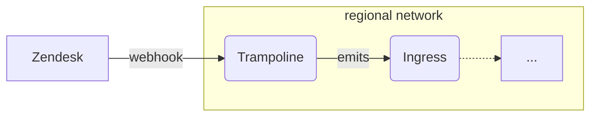

# `zendesk-events`

This module provisions infrastructure to listen to webhook events from Zendesk
(via Zendesk *event subscriptions*) and publish them to a broker.



More information on Zendesk webhooks and event subscriptions:
- https://developer.zendesk.com/documentation/webhooks/
- https://developer.zendesk.com/documentation/event-connectors/webhooks/verifying-webhook-authenticity/

Before publishing, the trampoline **redacts customer-identifying information**
from the event body (see [Redaction](#redaction) below). The events are then
published to a broker, which can be used to fan out the events to other
services, or filter based on their type.

You can use this with `cloudevent-recorder` to record Zendesk events to a
BigQuery table.

CloudEvent types are derived from the Zendesk event-subscription `type` field by
stripping the `zen:event-type:` prefix and prepending `dev.chainguard.zendesk.`.
For example, an event of type `zen:event-type:ticket.created` is published as
`dev.chainguard.zendesk.ticket.created`.

Only `ticket.*` events are forwarded. The recorder ships schemas for `ticket.*`
exclusively, and the redaction allowlist is only safe for ticket payloads, so any
other resource (e.g. `organization.name_changed`) is rejected — see below.

## Webhook signature verification

Zendesk signs the concatenation of the `X-Zendesk-Webhook-Signature-Timestamp`
header and the raw request body with HMAC-SHA256, and sends the result
base64-encoded in the `X-Zendesk-Webhook-Signature` header. The trampoline
rejects (HTTP 403) any request that is missing either header, whose timestamp is
unparseable or outside a 5-minute replay window, or whose signature matches none
of the configured secrets. Payloads without a `zen:event-type:` type prefix
(e.g. custom trigger/automation webhooks), and events for any resource other than
`ticket`, are rejected with HTTP 400.

```hcl
module "zendesk-events" {
  source = "./modules/zendesk-events"

  project_id = var.project_id
  name       = "zendesk-events"
  regions    = module.networking.regional-networks
  ingress    = module.cloudevent-broker.ingress

  secret_version_adder = "user:you@company.biz"
}
```

After applying this, copy the Zendesk webhook signing secret and configure it in
the GCP Secret Manager secret (`<name>-webhook-secret`). When the service is
exposed with `service-ingress = "INGRESS_TRAFFIC_ALL"`, the `public-urls` output
gives the endpoint to register in the Zendesk webhook settings.

## CloudEvent extensions

All forwarded events carry:
- `accountid` — Zendesk account ID (omitted when zero).

Ticket events additionally carry:
- `ticketid` — numeric ticket ID extracted from the `subject`
  (`zen:ticket:<id>`); the immutable workqueue key for downstream reconcilers.

## Using with `cloudevent-recorder`

The event payloads produced by this module are the Zendesk webhook payloads
after [redaction](#redaction). If you want to record these events using
`cloudevent-recorder`, you should set `ignore_unknown_values`, since event
payloads may contain fields not in the schema. The shipped schemas cover a
representative set of ticket events and are intended as a starting point — refine
them against real payloads as you subscribe to more event types.

## Redaction

Customer-identifying information is stripped from the event **body** before it is
forwarded, so nothing identifying lands in the broker, GCS, or BigQuery. The
CloudEvent `subject` attribute is scrubbed for the same tokens.

Body redaction is **deny-by-default** (`internal/redact`): the body is decoded
and walked, and a string value is kept only if its key is a known technical
field — opaque IDs, enum values (`status`, `priority`, `type`), timestamps, and
versions, derived from the recorder schemas. Every other string — subjects,
descriptions, comment bodies, requester names/emails, custom-field values, and
any field not in the allowlist — is **dropped**. Numbers are deny-by-default too:
only `account_id` (the sole INTEGER recorder column) is kept; a number under any
other key — e.g. a numeric custom field that could carry a phone number — is
dropped. Booleans and null are opaque and kept (e.g. `is_public`). String-encoded
identifiers like `organization_id`/`requester_id` are retained via the string
allowlist and remain the anonymous clustering keys. Tags are deny-by-default too:
only allowlisted prefixes (`cri:`, `customer:`) are kept and every other
free-form tag is dropped. The retained fields and kept tags then get a regex pass
that masks emails, IPv4/IPv6 addresses, per-customer `cgr.dev` registry paths,
`customer:` tag values, and common secret formats.

If that regex pass would produce invalid JSON, redaction **fails closed**: it
re-emits the body with every string dropped and increments
`zendesk_redact_fail_closed_total` so the degradation is observable. Downstream
consumers are expected to re-fetch authoritative ticket data from Zendesk by id,
so the persisted body is supplementary signal rather than a system of record.

<!-- BEGIN_TF_DOCS -->
## Requirements

No requirements.

## Providers

| Name | Version |
|------|---------|
| <a name="provider_google"></a> [google](#provider\_google) | n/a |
| <a name="provider_random"></a> [random](#provider\_random) | n/a |

## Modules

| Name | Source | Version |
|------|--------|---------|
| <a name="module_dashboard"></a> [dashboard](#module\_dashboard) | ../dashboard | n/a |
| <a name="module_http"></a> [http](#module\_http) | ../dashboard/sections/http | n/a |
| <a name="module_layout"></a> [layout](#module\_layout) | ../dashboard/sections/layout | n/a |
| <a name="module_logs"></a> [logs](#module\_logs) | ../dashboard/sections/logs | n/a |
| <a name="module_redact_fail_closed"></a> [redact\_fail\_closed](#module\_redact\_fail\_closed) | ../dashboard/widgets/xy | n/a |
| <a name="module_redaction"></a> [redaction](#module\_redaction) | ../dashboard/sections/collapsible | n/a |
| <a name="module_resources"></a> [resources](#module\_resources) | ../dashboard/sections/resources | n/a |
| <a name="module_this"></a> [this](#module\_this) | ../regional-go-service | n/a |
| <a name="module_trampoline-emits-events"></a> [trampoline-emits-events](#module\_trampoline-emits-events) | ../authorize-private-service | n/a |
| <a name="module_webhook-secret"></a> [webhook-secret](#module\_webhook-secret) | ../secret | n/a |
| <a name="module_width"></a> [width](#module\_width) | ../dashboard/sections/width | n/a |

## Resources

| Name | Type |
|------|------|
| [google_service_account.service](https://registry.terraform.io/providers/hashicorp/google/latest/docs/resources/service_account) | resource |
| [random_string.service-suffix](https://registry.terraform.io/providers/hashicorp/random/latest/docs/resources/string) | resource |
| [google_cloud_run_v2_service.this](https://registry.terraform.io/providers/hashicorp/google/latest/docs/data-sources/cloud_run_v2_service) | data source |

## Inputs

| Name | Description | Type | Default | Required |
|------|-------------|------|---------|:--------:|
| <a name="input_additional_webhook_secrets"></a> [additional\_webhook\_secrets](#input\_additional\_webhook\_secrets) | Additional secrets to be used by the service. | <pre>map(object({<br/>    secret  = string<br/>    version = string<br/>  }))</pre> | `{}` | no |
| <a name="input_create_placeholder_version"></a> [create\_placeholder\_version](#input\_create\_placeholder\_version) | Whether to create a placeholder secret version to avoid bad reference on first deploy. | `bool` | `false` | no |
| <a name="input_deletion_protection"></a> [deletion\_protection](#input\_deletion\_protection) | Whether to enable delete protection for the service. | `bool` | `true` | no |
| <a name="input_enable_profiler"></a> [enable\_profiler](#input\_enable\_profiler) | Enable cloud profiler. | `bool` | `false` | no |
| <a name="input_ingress"></a> [ingress](#input\_ingress) | An object holding the name of the ingress service, which can be used to authorize callers to publish cloud events. | <pre>object({<br/>    name = string<br/>  })</pre> | n/a | yes |
| <a name="input_name"></a> [name](#input\_name) | n/a | `string` | n/a | yes |
| <a name="input_notification_channels"></a> [notification\_channels](#input\_notification\_channels) | List of notification channels to alert. | `list(string)` | n/a | yes |
| <a name="input_product"></a> [product](#input\_product) | Product label to apply to the service. | `string` | `"unknown"` | no |
| <a name="input_project_id"></a> [project\_id](#input\_project\_id) | n/a | `string` | n/a | yes |
| <a name="input_provisioner"></a> [provisioner](#input\_provisioner) | The member-style identity of the account provisioning resources in this environment (e.g. serviceAccount:…). When set, it is granted access to the webhook secret so placeholder versions can be created. | `string` | `""` | no |
| <a name="input_regions"></a> [regions](#input\_regions) | A map from region names to a network and subnetwork. | <pre>map(object({<br/>    network = string<br/>    subnet  = string<br/>  }))</pre> | n/a | yes |
| <a name="input_secret_version_adder"></a> [secret\_version\_adder](#input\_secret\_version\_adder) | The user allowed to populate new webhook secret versions. | `string` | n/a | yes |
| <a name="input_service-ingress"></a> [service-ingress](#input\_service-ingress) | Which type of ingress traffic to accept for the service. Valid values are:<br/><br/>- INGRESS\_TRAFFIC\_ALL accepts all traffic, enabling the public .run.app URL for the service<br/>- INGRESS\_TRAFFIC\_INTERNAL\_LOAD\_BALANCER accepts traffic only from a load balancer | `string` | `"INGRESS_TRAFFIC_INTERNAL_LOAD_BALANCER"` | no |
| <a name="input_team"></a> [team](#input\_team) | Team label to apply to resources. | `string` | n/a | yes |

## Outputs

| Name | Description |
|------|-------------|
| <a name="output_public-urls"></a> [public-urls](#output\_public-urls) | Map of region to public URL for the service, if service-ingress is INGRESS\_TRAFFIC\_ALL. |
| <a name="output_recorder-schemas"></a> [recorder-schemas](#output\_recorder-schemas) | Map of CloudEvent type to BigQuery table schema for the ticket.* events this module emits, for wiring into a cloudevent-recorder. |
<!-- END_TF_DOCS -->
